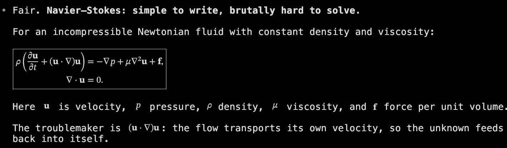
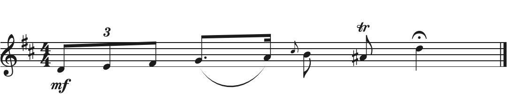

Terminal content rendering protocol
===================================

This protocol allows a program running in the terminal, hereafter called the
*client*, to render structured text as graphics. The terminal uses a locally
configured renderer and keeps the original source with the image. Changing
the font size renders the source again; copying the image returns the source,
even after the client exits.

It extends the :doc:`graphics protocol <graphics-protocol>`, reusing images,
virtual placements and Unicode placeholders. Clients send source and a kind,
such as ``math`` or ``barcode/qr``, without needing a rendering engine.
Terminals need not ship renderers: the user chooses them in local
configuration. If a kind or input is unsupported, the client displays the
source as ordinary text.

Some examples of rendered content:

   Math example.

   Music from :download:`ABC source <screenshots/content-music.abc>`.

Both barcodes below encode `https://github.com/kovidgoyal/kitty
<https://github.com/kovidgoyal/kitty>`__.

.. grid:: 1 2 2 2
   :gutter: 2

   .. grid-item::

      .. figure:: screenshots/content-qr.png
         :alt: QR code for https://github.com/kovidgoyal/kitty.
         :width: 180px
         :align: center

         QR code (``barcode/qr``).

   .. grid-item::

      .. figure:: screenshots/content-pdf417.png
         :alt: PDF417 barcode for https://github.com/kovidgoyal/kitty.
         :width: 324px
         :align: center

         PDF417 (``barcode/pdf417``).

   .. grid-item::

      .. figure:: screenshots/content-caffeine.png
         :alt: Chemical structure of caffeine.
         :align: center

         Caffeine (:download:`SMILES source <screenshots/content-caffeine.smi>`).

   .. grid-item::

      .. figure:: screenshots/content-aspirin.png
         :alt: Chemical structure of aspirin.
         :align: center

         Aspirin (:download:`SMILES source <screenshots/content-aspirin.smi>`).

The terminal's responsibilities are discovery, bounded render requests, image
placement and the lifetime of retained source. Renderer installation, APIs,
isolation and scheduling are implementation choices.

A minimal example
------------------

To display a QR code for ``https://github.com/kovidgoyal/kitty``, the client
queries support, requests a render and writes its placeholder cells. Here,
``<ESC>`` stands for the escape byte.

#. Query the kind, followed by a primary device attributes query (DA1)::

      client → terminal: <ESC>]8776;a=q:t=barcode/qr:R=101<ESC>\<ESC>[c
      terminal → client: <ESC>]8776;a=q:R=101:s=OK:B=4096:D=500<ESC>\
      terminal → client: <DA1 reply>

   Read both replies with terminal echo disabled. If DA1 arrives without the
   content reply, support was not established; display the URL as text.

#. Ask for a render within 40 columns and 12 rows, with the URL in base64::

      client → terminal: <ESC>]8776;a=d:t=barcode/qr:R=102:M=40:N=12;aHR0cHM6Ly9naXRodWIuY29tL2tvdmlkZ295YWwva2l0dHk=<ESC>\
      terminal → client: <ESC>]8776;a=d:R=102:s=OK:i=42:c=8:r=4:w=80:h=80<ESC>\

   These example dimensions assume 10 by 20 pixel cells. Use the image ID
   and dimensions returned by the terminal, and match the reply using ``R``.
   On an error or timeout, display the URL as text.

#. Write an 8 by 4 rectangle of :ref:`Unicode placeholders
   <graphics_unicode_placeholders>` for image 42. Give each cell its row and
   column diacritics, and end each image row with a hard line break. Reset
   the text colors afterward. Only these cells make the image visible.

The :ref:`shell example <content_example>` below shows the full placeholder
loop. The following sections describe discovery, rendering, display and
copying; :ref:`content_reference` gives the wire format and request lifecycle.

Protocol overview
-----------------

This protocol covers discovering support, sizing, placement, replies and the
retention of source. How renderers are installed and configured, and how the
terminal talks to them, is left to each terminal. Implementing this protocol
does not require a particular helper or renderer API. The protocol uses its
own OSC code and reuses the virtual placements, deletion commands and Unicode
placeholders of the graphics protocol. There is no compression, file transfer
or shared-memory transport.

Throughout this document, a *connection* is one terminal session: the byte
stream between a terminal instance and the processes attached to its pty.
*Reset* means a full reset (RIS). A soft reset (DECSTR) does not affect the
state of this protocol.

Querying support
----------------

To detect support for the protocol, send ``a=q`` without ``t``. The terminal
must report support even when no renderers are configured, and return ``B``,
its source size limit in bytes, and ``D``, its :ref:`render deadline
<content_deadlines>` in milliseconds. Queries and listings have no payload
in the request; a non-empty one fails with ``EINVAL``::

   <ESC>]8776;a=q:R=1<ESC>\
   <ESC>]8776;a=q:R=1:s=OK:B=131072:D=500<ESC>\

With ``t``, the terminal reports success only for a kind that is configured.
The reply does not include ``t``; the client matches it to the query using
``R``. The ``B`` in this reply may be lower than the terminal-wide limit. With
no renderers configured, every kind query returns ``ENOTSUP``. Note that
queries do not parse any source, and success does not guarantee that a render
will succeed::

   <ESC>]8776;a=q:t=math:R=2<ESC>\
   <ESC>]8776;a=q:R=2:s=OK:B=1024:D=500<ESC>\
   <ESC>]8776;a=q:t=unknown:R=3<ESC>\
   <ESC>]8776;a=q:R=3:s=ENOTSUP;VW5zdXBwb3J0ZWQga2luZA==<ESC>\

Clients can also :ref:`list the available kinds <content_listing>`.

The terminal must answer queries and listings from its local metadata, as soon
as it parses them, without invoking renderers or waiting for queued renders.
It must queue these replies before the reply to any subsequent primary device
attributes (DA1, ``CSI c``) query. Where both escape codes pass through,
clients can use this ordering to detect an OSC query that was ignored: if the
DA1 reply arrives first, the query was ignored somewhere along the way.

When this protocol is disabled in the configuration, the terminal must ignore
OSC 8776 escape codes without replying, and must not re-render retained
content. Retained images keep their last pixels, scaled to their cells as for
a failed re-render, and copying and exporting still substitute the retained
source.

Falling back to text
^^^^^^^^^^^^^^^^^^^^

For a reliable fallback, the client queries the kind, requests rendering, and
writes placeholders only after the render succeeds. A successful kind query
alone is not enough. On failure or timeout, the client prints the source as
ordinary text; a successful render that arrives late stays invisible, since
there are no placeholders for it. Applications must print the fallback
themselves, because terminals that do not support this protocol do not
display OSC payloads. Clients should print text when their output is
redirected, or goes through intermediaries that cannot carry the protocol.

Content kinds
-------------

Kind identifiers contain 1 to 64 ASCII letters, digits or the characters
``-_.+/``, and are matched exactly. The terminal routes them to configured
renderers without inspecting the source or guessing its format.

A kind names an input format and its meaning, independently of the renderer.
Examples include ``math``, ``smiles``, ``abc``, ``barcode/qr`` and
``barcode/ean13``. Supporting these kinds is optional. A successful kind
query reports availability, not support for every extension of its format.

Additional kinds need no change to the transport. Their authors should
publish the grammar or format version, semantic examples and error cases.
Incompatible interpretations need different identifiers; private extensions
should use a project prefix, such as ``example/diagram``.

Renderers must reject unsupported constructs rather than silently change
meaning. Fonts, colors and internal layout may differ, while preserving
meaning and the requested cell dimensions. Pixel-identical output is not
required.

.. _content_sizing:

Rendering content
-----------------

The terminal passes the :ref:`captured rendition and cell metrics
<content_lifecycle>` to the renderer; other SGR attributes are unspecified.
Unless the kind itself specifies colors, the renderer uses that foreground
color over transparency or the supplied background, as it chooses.

The renderer works out the natural layout of the content from the source and
the cell metrics, including any padding the content needs. It must use a
consistent natural scale for all inputs of the same kind; what that scale
means is up to the kind. ``c`` and ``r`` specify an exact number of columns
and rows, ``M`` and ``N`` specify maximums, and zero leaves them unspecified.
The renderer must follow these sizing rules:

#. With no exact dimension, keep the natural scale, shrinking the content
   uniformly to fit within ``M``. ``N`` is checked after fitting the width and
   rounding to whole cells, and exceeding it is ``EFBIG``. Bounds never
   enlarge content. To scale the height, the client specifies ``r``.
#. With one exact dimension, scale uniformly to fit it, and derive the other.
   With both exact, use the largest uniform scale that fits.
#. ``F=1`` caps the scale at the natural size. Exact dimensions still set the
   size of the canvas, and unused space is padded.
#. Round unspecified canvas dimensions up to whole cells. The renderer chooses
   how to align the content within the padding. Never crop the content to
   meet the constraints.
#. A kind with discrete scales, such as a whole number of pixels per barcode
   module, uses the largest scale it can represent that does not exceed the
   scale given by these rules. It derives unspecified dimensions from the scale
   it actually used, and pads the rest of the canvas, including any exact
   dimensions it cannot fill. If it can represent no scale that fits, the
   render fails with ``EFBIG``.

The terminal must enforce these limits:

* The terminal must reject exact dimensions larger than their maximums with
  ``EINVAL``, and derived dimensions larger than their maximums with
  ``EFBIG``. The terminal never changes exact dimensions to make them fit.
* The terminal must reject a size of more than 297 columns or 297 rows with
  ``EFBIG``, whether it was requested exactly or computed, because the
  :ref:`placeholder diacritics <graphics_unicode_placeholders>` can only
  address rows and columns 0 to 296. The limit does not implicitly shrink
  content that is too large.

Renderers may also reject boxes that are too small for valid or legible output
with ``EFBIG``, and the terminal reports arithmetic overflow as ``EFBIG`` too.

A successful reply includes ``i``, positive ``c`` and ``r``, and positive
pixel dimensions ``w`` and ``h`` covering the whole canvas, which is a whole
number of cells. When the request specified a nonzero ``p``, the reply
includes the ID of the installed placement, as a canonical decimal number;
otherwise the reply omits ``p``. The optional signed ``b`` gives the baseline
in pixels, down from the top of the canvas. Negative values are above the
canvas, and ``b=0`` is a baseline at its top. The value may lie outside the
canvas. The terminal omits ``b`` when no baseline is meaningful.

The geometry in the reply describes the render at the captured cell metrics.
If the cell size changes before the result is installed, the terminal must
still install it into the cells it reported, and then re-render it as for any
later font change. The terminal does not update ``w``, ``h`` or ``b`` after
replying, so clients must not assume they are still current after a font
change.

Measuring and releasing renders
^^^^^^^^^^^^^^^^^^^^^^^^^^^^^^^

Rendering without writing placeholders is how you measure content; there is
no separate operation for it. Note that rendering allocates storage in the
terminal, even when no placeholders are ever displayed. Clients must release
successful renders they do not use with the graphics protocol's
``a=d,d=I,i=<id>`` command, when they know the image ID and have not reset the
terminal or switched screens since sending the render request. This includes
images used only for measurement, results the client rejected for its own
reasons, and successful replies that arrived late. Otherwise, clients must
leave reclaiming the storage to the terminal. Specifying an image ID in the
request allows cleaning up without a reply, under the same conditions.

Displaying content
------------------

The terminal creates an invisible virtual placement, with ``z`` as its
stacking order. Clients display it by writing :ref:`U+10EEEE placeholders
<graphics_unicode_placeholders>`, using the cell dimensions from the reply.
These cells control the position, scrolling, erasing and reflow of the
content. There is no key to choose a placement mode or to move the cursor.
Clients must take care of the following:

* Clients manage line breaks, and reset or restore the text colors after
  writing the image and placement IDs as colors.
* Clients must not send a final chunk while an image ID color is the current
  foreground, since the terminal cannot tell a color that encodes an image ID
  from a color intended for text.
* Rows of placeholders. Clients should keep each row within the width of the
  terminal. For rows that could wrap, including after a resize, they must
  specify both the row and column diacritics on every cell. This avoids
  depending on the graphics protocol inferring columns across physical lines.
  The rendered image always remains a single rectangle; these rules concern
  only its placeholder cells.

When the request has no ``p``, or ``p=0``, the new virtual placement is
unnumbered; the terminal does not allocate a placement ID for it. Separately,
a placeholder with no underline color, or an underline color of zero, may
refer to any virtual placement of the image, as the graphics protocol
specifies. So images with a single placement need no underline color. In this
protocol, ``p`` must be between 0 and 16777215, inclusive, and the terminal
must reject larger values with ``EINVAL``. This range fits the 24-bit
underline color of the placeholder, and does not change the range of
placement IDs in the graphics protocol.

Clients that specify both the image ID and the exact cell dimensions can write
placeholders without waiting for the reply. However, suppressing replies means
giving up confirmation of success, and with it a reliable text fallback.

Image IDs
^^^^^^^^^

``R``, ``i`` and ``p`` are independent of each other. Images and placements
share the per-screen namespaces of the graphics protocol. For ``i=0``, the
terminal allocates a nonzero image ID that fits in 24 bits, and is neither
used by an existing image nor reserved by a pending render. It must not reuse
an ID it previously allocated for this protocol while old placeholders could
still remain, on screen or in the scrollback, even after the image data was
deleted or evicted. When no IDs are left, the request fails with ``EFBIG``.
These rules do not change the range of image IDs, or how they are allocated,
in the graphics protocol. Clients that specify image IDs themselves are
responsible for choosing them.

The placement and deletion commands of the graphics protocol apply to these
images; there is no need to transmit an image with the graphics protocol. A
successful ``a=d`` render to an existing image ID follows the graphics
protocol's :ref:`replacement rules <graphics_display_images>`, removing the
old image and all its placements before installing the new pixels, source and
virtual placement. Retransmitting the whole image with the graphics protocol
also replaces it, and removes its association with the source.

Other successful changes to pixels with the graphics protocol, including
editing frames (``a=f``) and composition (``a=c``), clear the association
with the source and stop re-rendering from it. They otherwise behave as they
always have. Failed changes, and changes to placements only, do not clear the
source. Clients that need old scrollback to keep its meaning must use fresh
image IDs for new content.

Interaction with other terminal actions
---------------------------------------

Images follow the graphics protocol's :ref:`rules for reset, the alternate
screen, erasing the display and scrolling <graphics_interaction>`.
Placeholders wrap and reflow like ordinary text.

Pending renders follow the :ref:`cancellation rules <content_cancellation>`.
Full-screen programs that redraw by erasing the display should erase before
requesting renders, or wait for outstanding replies first.

Retaining and copying source
----------------------------

The terminal must keep each image's kind, exact source bytes, sizing policy,
rendition and final cell size, even after the program that sent it exits. The
source lives as long as the image data, unless a pixel change with the
graphics protocol clears the association. Deleting placements while keeping
the image data also keeps the source. Freeing or evicting the image data
releases its source, leaving nothing to substitute when copying or exporting.

When the font or cell size changes, the terminal must re-render the content
into the cells it already occupies, keeping the image ID, placements and
association with the source. The re-render follows the sizing rules, with the
existing cells as both exact dimensions and the original ``F``. A render that
was originally requested without exact dimensions uses ``F=1``, keeping its
natural scale rather than growing to fill the cells. Content whose natural
size at the new cell size is larger than the cells shrinks to fit; it is
never cropped. If the re-render fails, the terminal must keep the previous
pixels, scaled to the same cells.

Terminals should remember when a rendition uses default or indexed colors,
and re-render when those colors change. Explicit RGB colors stay fixed. The
terminal must never take the foreground color of the content from the image
ID color of a placeholder cell.

When copying or exporting text, as plain text or with ANSI styling, including
selections, buffer exports and viewing the scrollback in a pager, the
terminal must substitute the original source, never a description from the
renderer:

* It emits the complete source once for each selected *occurrence* of the
  image, at its first selected cell, even when only part of the occurrence is
  selected, and emits nothing for the remaining cells. Two selected
  occurrences produce two copies of the source.
* It must preserve the order of other text and the newlines in the source,
  even if the geometry of the export differs.
* Exporting needs no renderer, and ANSI exports may add ordinary text
  styling. There is no such compatibility guarantee for raw recordings of the
  bytes the program sent.

Roughly, an occurrence is one printed copy of the image, even if its rows
wrapped. Clients that need copying to be stable must end each row of
placeholders with a hard line break; see :ref:`content_occurrences` for
the precise rules.

.. _content_reference:

Protocol reference
------------------

The following sections specify the wire format and the less common cases.
They are part of the protocol, including for terminals that use their own
renderer API. Discovery, rendering and copying must behave the same way
regardless of how the terminal schedules work.

The content rendering escape code
^^^^^^^^^^^^^^^^^^^^^^^^^^^^^^^^^

The protocol uses OSC **8776** with the following form::

   <ESC>] 8776 ; <key>=<value>[:<key>=<value>]* [;<payload>] <ESC>\

Spaces in this definition are for clarity only. ``ESC`` is the byte ``0x1b``.
Senders, whether client or terminal, use the seven-bit forms ``ESC ]`` and
``ESC \``, and receivers also accept ``BEL (0x07)`` as the terminator. The
eight-bit forms need not be supported.

The metadata is a colon-separated list of ``key=value`` pairs:

* Keys and values are case-sensitive ASCII. Keys contain letters, digits and
  ``_``. Values must not be empty, and contain visible ASCII (``0x21`` to
  ``0x7e``) other than ``:`` and ``;``.
* Unsigned integers contain only decimal digits and fit in 32 bits. ``z`` and
  ``b`` are signed 32-bit integers, with an optional leading minus sign. A
  plus sign is not allowed. Leading zeros do not matter, so ``R=007`` and
  ``R=7`` are the same token, and ``-0`` is zero.
* Numeric fields that are not specified default to zero, unless stated
  otherwise. Flags accept only the values listed for them.
* Both clients and terminals must ignore keys they do not know. The terminal
  also ignores keys that this specification defines only for other actions,
  except on continuation chunks, as described under `Errors in chunks`_.
  Ignored keys must still follow the key and value syntax and the rule
  against duplicate keys, but their numbers and flags are not validated.

Extensions preserve existing behavior and provide a capability query.
Clients must use that query before relying on the extension.

The payload carries the source. A missing payload is the same as an empty
payload after the ``;``. The client must encode each chunk of source
independently in standard :rfc:`base64 <4648>`, with the padding and without
whitespace. Whoever receives a message may either reject or ignore tab, LF, CR
and space inside the payload, but must not tolerate them anywhere else in the
escape code. Once all chunks are put together, the source must be valid
UTF-8.

The terminal must reject source containing C0 controls (``U+0000`` to
``U+001F``, including ``ESC``) other than tab, LF and CR, as well as
``DEL (U+007F)`` and the C1 controls (``U+0080`` to ``U+009F``). It must pass
the source on unchanged, without normalizing whitespace, line endings or
Unicode. Ordinary backslashes need no extra escaping.

The following limits do not count the OSC framing:

.. csv-table:: Size limits
   :header: "What", "Limit"

   "Metadata", "1,024 bytes"
   "Payload per chunk", "4,096 encoded bytes, which is 3,072 decoded bytes"
   "Total source", "131,072 decoded bytes; the ``B`` key reports the terminal's own limit, which may be lower"

.. _content_listing:

Listing available kinds
^^^^^^^^^^^^^^^^^^^^^^^

To list the available kinds, send ``a=l``. The terminal returns up to 16
kinds in ascending ASCII order, separated by LF without a trailing LF, and
base64-encoded. The reply has ``m=1`` if there are more pages, or ``m=0`` for
the last page. A page with ``m=1`` must contain at least one kind. To get the
next page, the client sends ``after=<last-kind>``, which returns only names
that sort strictly after it. The ``after`` value uses kind syntax and is
omitted for the first page. Listings expose no paths or renderer
configuration, and do not reserve any renderer.

When no renderers are configured, or no kinds follow the cursor, the terminal
returns an empty successful listing with ``m=0``, and a trailing ``;`` for the
empty payload::

   <ESC>]8776;a=l:R=6<ESC>\
   <ESC>]8776;a=l:R=6:s=OK:m=0;<ESC>\

Transferring source in chunks
^^^^^^^^^^^^^^^^^^^^^^^^^^^^^

Source can be sent in a single message, or in multiple chunks that share a
nonzero ``R``. For example, here is ``x^2`` followed by ``+ y^2``, with a
leading space, sent in two chunks::

   <ESC>]8776;a=d:t=math:R=5:M=80:N=12:m=1;eF4y<ESC>\
   <ESC>]8776;a=d:R=5:m=0;ICsgeV4y<ESC>\
   <ESC>]8776;a=d:R=5:s=OK:i=43:c=7:r=2:w=70:h=40:b=24<ESC>\

* The first chunk contains ``t`` and all the rendering metadata.
* Continuation chunks omit ``t`` and contain only ``a=d``, ``R``, ``m`` and the
  payload.
* Every chunk of a multipart upload must carry the same nonzero ``R``.
* ``m=1`` means more chunks follow, and ``m=0``, the default, completes the
  upload.
* Every chunk except the last must be non-empty. The last chunk may be empty,
  but a complete source that is empty fails with ``EINVAL``.
* Uploads with different tokens may be interleaved, but only as whole OSC
  escape codes, never as bytes within one. Chunks are put together in the
  order they arrive; there is no chunk index.

The terminal must decode each chunk separately, put the results together, and
only then validate the UTF-8, since characters may be split across chunks. The
terminal must not start parsing the source as its kind, or rendering it,
before the final chunk has been validated. The first chunk supplies the
reply policy for the whole request.

Note that chunking does not guarantee that intermediaries such as terminal
multiplexers will support or deliver the upload.

.. _content_lifecycle:

Request lifecycle
^^^^^^^^^^^^^^^^^

Terminals may render synchronously or continue processing input while a render
is pending. Clients match replies using ``R``: a render reply can arrive after
replies to later requests, including cursor position reports and DA1. Queries
and listings retain the ordering required by `Querying support`_.

The reply policy is ``q=0`` for all replies (the default), ``q=1`` for errors
only, or ``q=2`` for no replies.

A request is *outstanding* from its first message until it completes or is
silently discarded. It *completes* when its final outcome has been committed
and any reply allowed by ``q`` has been queued. Completion releases its token
even when replies are suppressed. Finishing an upload does not complete its
pending render.

On the final chunk, the terminal must capture the active screen, its cell
metrics, and the colors for ordinary text under the current SGR attributes
and screen-wide reverse video state. This color state is the *rendition*.
Rendering uses these captured values, even if the terminal state changes
before completion.

The terminal sends one final reply per request, unless ``q`` suppresses it or
the protocol requires silence. A render can return ``OK`` only after
installing its pixels, source and virtual placement. There are no unsolicited
rendering notifications. The terminal must not move the cursor for these
requests. On error, the terminal must not create placements or replace
retained content, and must discard later results from that request.

.. _content_deadlines:

Deadlines and retries
~~~~~~~~~~~~~~~~~~~~~

``D`` bounds the time from parsing the final chunk to completion, including
time queued inside the terminal. It applies even when ``q`` suppresses the
reply. The terminal must fail a render it cannot finish in time with
``ETIMEDOUT`` or ``EBUSY``. Transport and time spent waiting unparsed in the
terminal's input are outside this deadline.

A synchronous terminal can leave later requests, including queries, unparsed
behind earlier renders from any client on the connection. With ``N`` requests
outstanding, clients should allow about ``N × D`` for the last reply, plus
transport time. A client-side timeout leaves the outcome unknown; a query
timeout does not prove that support is absent.

``EBUSY`` must include a positive ``retry`` delay in milliseconds approximating
the remaining wait, including failure backoff. This is advice, not a
reservation. Clients may retry with a fresh token or fall back to text.
Permanent unavailability must become ``ENOTSUP`` or ``EIO``, rather than
``EBUSY`` forever.

Incomplete uploads may expire silently. When the terminal cannot accept a
new upload, it replies with ``EBUSY`` or ``ENOMEM``.

.. _content_cancellation:

Cancellation
~~~~~~~~~~~~

After the final chunk, a pending render targets the requested image ID or one
reserved by the terminal. These events must cancel pending work, with an
``ECANCELED`` reply subject to ``q`` unless the table specifies silence:

.. list-table:: Cancellation rules
   :header-rows: 1
   :widths: 60 40

   * - Event
     - Effect
   * - A screen is cleared, including clearing the alternate screen on entry.
     - Cancel renders captured for that screen, even if no image has been
       installed.
   * - A graphics command directed at the target ID frees or replaces image
       data, or successfully changes pixels: deletion with an uppercase
       selector, retransmission, frame editing or composition.
     - Cancel pending renders for that ID.
   * - A render submitted later for the same target ID succeeds.
     - Cancel older pending renders for that ID.
   * - The terminal resets or the connection closes.
     - Discard uploads and pending renders silently. This takes precedence
       over cancellation by screen clearing.

Switching screens while preserving the original screen leaves its pending
renders running; they complete on that screen. Placement-only deletions and
deletions by position or visibility do not cancel pending renders. A later
render that fails also leaves earlier renders running.

Cancellation produces no further reply after completion. The terminal must
discard cancelled work; late results must never restore it or appear in
another screen or tab.

Requests and replies
^^^^^^^^^^^^^^^^^^^^

There are three actions. ``a=q`` queries support, ``a=l`` lists the available
kinds, and ``a=d``, the default, renders content into a virtual placement. The
:ref:`key reference <content_keys>` below lists all the keys. For timing,
completion and cancellation, see :ref:`content_lifecycle`.

The ``R`` key identifies a request, not the content. A nonzero token must be
unique among the outstanding requests on a connection, and is required for
uploads that span multiple chunks. ``R=0``, the default, is for independent
single-message requests whose replies need not be told apart. Such a request
never invalidates another request through token reuse. Clients must use
nonzero tokens when they need to tell concurrent replies apart. Clients should
never reuse a nonzero token on a connection, for example by counting upward
from a random starting point; the 32-bit space is ample.

The terminal replies using the same escape code, always terminated by
``ESC \``. Every reply carries ``a``, ``R`` and ``s=<status>``, where ``a`` is
the reply type, one of ``q``, ``l`` or ``d``. Only ``s=OK`` means success;
any status code the client does not recognize is an error.

Replies are built only from fixed protocol tokens, numbers written by the
terminal and base64 payloads; they never copy raw bytes from the request.
Numeric values may be the same as those the client sent, including ``i``,
``p``, ``c`` and ``r``. The terminal writes all numbers in canonical decimal,
without leading zeros, and zero as ``0``. ``R`` is the parsed request token,
or ``0`` when it was omitted, so clients compare tokens as numbers. Apart from
the OSC framing, replies contain only ASCII letters, digits and the characters
``_=:;+/-``.

Successful queries and renders have no payload; listings carry kind names.
Errors may carry a base64-encoded UTF-8 diagnostic, of at most 512 decoded
bytes, following the same control character restrictions as source. Clients
act on the status code, not on the diagnostic text. Terminals must not forward
raw diagnostics from renderers or quote values from the request in them.

.. csv-table:: Reply status codes
   :header: "Status", "Meaning"

   "``OK``", "Completed."
   "``ENOTSUP``", "Unsupported action, kind or kind feature."
   "``EINVAL``", "Invalid envelope, source or conflicting constraints."
   "``EFBIG``", "Source/output limit or automatic image-ID space exhausted, or minimum valid rendering cannot fit the box."
   "``ENOMEM``", "Insufficient storage."
   "``EBUSY``", "Retryable temporary unavailability. ``retry`` gives a suggested delay in milliseconds."
   "``ETIMEDOUT``", "Render deadline exceeded."
   "``ECANCELED``", "Pending render invalidated by screen clearing, image deletion, replacement or pixel mutation."
   "``EIO``", "Renderer failed or returned invalid output."

.. _content_keys:

Control data reference
^^^^^^^^^^^^^^^^^^^^^^

The table below lists the defaults for requests and the requirements for
replies.

.. csv-table:: Protocol keys
   :header: "Key", "Used in", "Default", "Meaning"

   "``a``", "Requests/replies", "``d``", "``q`` query, ``l`` list, ``d`` render. In replies, the reply type; ``d`` for an invalid or unknown action."
   "``R``", "Requests/replies", "``0``", "Request token. Nonzero for multipart; returned in canonical decimal in every reply."
   "``t``", "Kind queries, first render chunk", "Unset", "Kind. Required on first render chunk, forbidden on continuations. Never returned in replies."
   "``after``", "List requests", "Unset", "Pagination cursor. Names strictly after this kind; unset for first page."
   "``q``", "Requests", "``0``", "``0`` all replies, ``1`` errors only, ``2`` none. On render continuations, ``EINVAL``. A duplicated or invalid ``q`` supplies no policy."
   "``m``", "Render chunks, list replies", "``0`` on requests", "``1`` more, ``0`` final. Mandatory on list replies."
   "``c``, ``r``", "First render chunk, render replies", "``0``", "Exact columns/rows; zero unspecified. Successful replies give dimensions from 1 to 297."
   "``M``, ``N``", "First render chunk", "``0``", "Maximum columns/rows; zero unbounded by client. ``M`` bounds width fitting; ``N`` bounds resulting height."
   "``F``", "First render chunk", "``0``", "``0`` scales to exact box; ``1`` prevents enlargement above natural size. Bounds alone never enlarge."
   "``i``", "First render chunk, render replies", "``0``", "Image ID; zero requests terminal allocation. Successful replies give nonzero ID."
   "``p``", "First render chunk, successful render replies", "``0``", "Graphics protocol placement ID of the virtual placement, 0–16777215 in this protocol; larger values are ``EINVAL``. Zero leaves the placement unnumbered. Successful replies return ``p`` only when nonzero."
   "``z``", "First render chunk", "``0``", "Signed 32-bit graphics protocol stacking order of the virtual placement."
   "``s``", "All replies", "Required", "``OK`` or error code."
   "``B``", "Successful query replies", "Required", "Terminal/kind source-byte limit, at most 131,072."
   "``D``", "Successful query replies", "Required", "Positive render deadline in milliseconds; see :ref:`content_deadlines`."
   "``retry``", "``EBUSY`` replies", "Required", "Positive delay in milliseconds approximating the remaining wait, including failure backoff."
   "``w``, ``h``", "Successful render replies", "Required", "Positive canvas dimensions in device pixels."
   "``b``", "Successful render replies", "Unset", "Signed 32-bit baseline from canvas top. Zero is valid; negative is above it. Omitted if meaningless."

.. _content_occurrences:

Identifying image occurrences
^^^^^^^^^^^^^^^^^^^^^^^^^^^^^

An *occurrence* consists of placeholder cells with the same image ID,
placement ID and *logical origin*. Decode each cell's zero-based image row
and column ``(r, c)`` as in the graphics protocol. Soft-wrapped physical
lines form one logical line; a hard line break starts the next one.

For a cell on logical line ``L`` at cell offset ``X``, the logical origin
is ``(L - r, X - c)``. Cells with equal origins belong to the same occurrence,
even if some cells are erased or unselected. No physical-origin links or
transitive grouping are needed. For example, a four-column image in a
three-column terminal has these coordinates (each entry is ``r,c``)::

   logical line 0:  [0,0] [0,1] [0,2]  ← soft wrap
                   [0,3]              ← hard line break
   logical line 1:  [1,0] [1,1] [1,2]  ← soft wrap
                   [1,3]

Every cell has origin ``(0, 0)``. Selecting any part of either row emits the
source once. Printing a second copy at another origin emits it again.

Clients must end each image row with a hard line break and start the next at
the same logical offset for it to be one occurrence. Advancing the image row
across an automatic wrap, without a hard line break, changes the logical
origin: those rows are separate occurrences and can copy the source more
than once. This rule continues to apply after a terminal resize.

Selection boundaries do not redefine logical lines. When a selection starts
inside a soft-wrapped line, account for its retained prefix to recover the
cell offsets and any inferred diacritics. There is no need to inspect
unrelated scrollback or follow links through unselected cells. During a
forward export, origins more than 296 logical lines behind the current line
can be forgotten, since no valid placeholder row can refer to them.

Placeholders that refer to no retained source fall into two cases:

* If a live image has the ID but no source, because of retransmission or a
  pixel change with the graphics protocol, it is just a graphics protocol
  image. Its placeholders are copied the way the terminal already copies
  placeholders of any other image.
* If no live image has the ID, because its data was deleted or evicted, the
  terminal must omit the placeholders while it still remembers that this
  protocol rendered that ID. The terminal may limit how much of this it
  remembers; beyond that limit, these placeholders are also copied the way the
  terminal already copies them.

.. _content_errors:

Handling errors
^^^^^^^^^^^^^^^

This section collects what happens when messages are malformed, tokens
collide, or work has to be abandoned. Many of these rules share one concern: a
reply that no client reads can reach a shell as input, so when the terminal
cannot be sure who a reply is for, it stays silent.

Malformed and oversized messages
~~~~~~~~~~~~~~~~~~~~~~~~~~~~~~~~

* The terminal rejects duplicate keys, empty values, malformed numbers and
  invalid encodings with ``EINVAL``.
* Actions must be a single character: other lengths fail with ``EINVAL``, and
  unknown single-character actions fail with ``ENOTSUP``. Both kinds of
  failure are answered as ``a=d``.
* The terminal must skip an oversized escape code up to and including its
  terminator, without acting on it. When the request token can be validated
  from the complete metadata, within the metadata limit, the terminal must
  treat the oversized message according to the rules for chunks below, with
  the status ``EFBIG``. That is, it aborts the matching upload, rejects a new
  request, or silently discards a continuation that matches no upload.
* Duplicate or malformed ``R`` fields, and truncated metadata, must never
  supply a token.
* Only ``ESC \`` or ``BEL`` completes a message. An OSC 8776 escape code that
  ends any other way, for example because of a CAN or SUB, or an ESC that
  starts another escape code, is malformed and never supplies a token, even if
  the bytes received so far would parse.
* The terminal must never turn malformed bytes into a valid request by
  removing control characters from any part of the message, including the OSC
  number. It must reject or silently discard such a message instead. So if a
  terminal's parser drops control bytes from OSC strings, it must record that
  it did so, and where, so that the protocol handling forgives nothing except
  tab, LF and CR inside the payload.

If the terminal cannot tell which request a message belongs to, it must
silently discard that message, and also every incomplete upload on that
connection, since a later continuation could otherwise complete a source with
a missing chunk. The same applies to malformed messages that are discarded
without a trustworthy token, including escape codes ended by anything other
than ``ESC \`` or ``BEL``. Note that on a shared connection this also
abandons the incomplete uploads of other clients. That is intentional, since
the terminal has no way to tell which upload lost a chunk.

Who gets an error reply
~~~~~~~~~~~~~~~~~~~~~~~

An error reply follows the reply policy of the outstanding request whose token
the message matches, and otherwise the message's own ``q``. A message whose
own ``q`` is duplicated or invalid has no policy of its own. If no outstanding
request supplies one, the terminal must discard the message silently, so that
an unwanted reply can never become input to a shell.

Errors in chunks
~~~~~~~~~~~~~~~~

The terminal classifies each message that has a trustworthy token before
acting on it:

* A message with no ``t`` and no action other than ``d`` is a continuation.
* Any other message is a new request: ``t`` starts a new render, and any
  other action, valid or not, starts a new request even without ``t``.

``R=0`` with ``m=1``, or on a continuation, fails with ``EINVAL`` under the
message's own ``q``, without affecting other requests.

A continuation applies only to an incomplete upload with the same token:

* If there is no such upload, the terminal must discard the continuation
  silently, whether or not it is otherwise valid. That includes continuations
  that arrive after the upload has failed or expired, and while the render of
  a completed upload is pending.
* If there is such an upload, a malformed continuation aborts it with
  ``EINVAL``. That covers every ``EINVAL`` condition of
  `The content rendering escape code`_
  and `Malformed and oversized messages`_, a ``q`` or any other known key
  that belongs only on the first chunk, invalid base64 and an empty chunk
  that is not the last.
* An oversized chunk, or too much source in total, aborts the upload with
  ``EFBIG``.
* Unknown keys are ignored, as usual.

Token reuse
~~~~~~~~~~~

A new request whose nonzero ``R`` is already outstanding invalidates the
outstanding request, and is itself rejected. The terminal replies exactly once
for both, under the outstanding request's reply policy, with the reply type
taken from the new message's action, or ``a=d`` if that is invalid or unknown.
The status is the new message's own error (``EFBIG`` when oversized,
``ENOTSUP`` for an unknown action, ``EINVAL`` when malformed), or ``EINVAL``
if the new message is otherwise valid. A new request whose token is not
outstanding receives its normal error, even without a kind.

So clients replacing an abandoned upload must use a fresh token. A client that
abandons a request must not display a late result, and must avoid reusing its
token while old chunks or replies could still arrive. Note that with ``q=2`` a
client cannot tell when a request has completed, and reusing a token whose
render is still pending silently cancels both requests. Clients release late
successful renders as described under `Measuring and releasing renders`_.
Multiplexers that implement this protocol should route replies to the right
client and prevent token collisions.

Security considerations
^^^^^^^^^^^^^^^^^^^^^^^

Only the user's local configuration chooses renderers. Requests cannot name
executable paths, install code or change renderer settings. Both the source
and the output of renderers are untrusted. Receiving source does not give
access to any local resources. How renderers are isolated, and what they are
allowed to run, is outside the scope of this protocol.

Copied or exported source may contain syntax and newlines that are not visible
in the rendered image. The terminal must treat it as untrusted text, and keep
its normal protections for the clipboard and pasting.

A reply that no client reads can reach a shell as input. That is why replies
are limited to the characters listed under `Requests and replies`_, and
contain nothing from the request other than decimal numbers. Silently
discarding expired uploads, and messages without a trustworthy token or reply
policy, serves the same goal.

Rendering spends local CPU time and memory on behalf of untrusted output.
Terminals limit that work according to their own policy, and report it with
``EBUSY``, ``ENOMEM`` and ``ETIMEDOUT``. The protocol promises clients a
fallback to text, not a render.

Queries and listings reveal which kinds the user has configured to any program
that writes to the terminal, including programs running on remote machines.
Like other queries that identify the terminal, this can be used for
fingerprinting. Listings expose no paths or renderer configuration, and users
can disable the protocol.

.. _content_example:

A shell example
---------------

With a QR renderer configured, paste this into zsh or bash 4.2 or newer,
using a UTF-8 locale and a terminal at least 24 columns wide. It displays
a QR code for ``https://github.com/kovidgoyal/kitty`` at a fixed size.
Older shells, including macOS's ``/bin/sh``, do not understand the
``\U`` escapes.

This demonstration uses ``q=2`` because the shell does not read replies.
It therefore cannot detect failure or provide a reliable text fallback.
See `A minimal example`_ for the request/reply flow applications should use.

.. code-block:: sh

   printf '\e]8776;a=d:t=barcode/qr:R=102:i=42:c=24:r=12:q=2;aHR0cHM6Ly9naXRodWIuY29tL2tvdmlkZ295YWwva2l0dHk=\e\\'
   d=0305030D030E03100312033D033E033F0346034A034B034C0350035103520357035B0363036403650366036703680369
   printf '\e[38;2;0;0;42m'
   for r in {0..11}; do
     for c in {0..23}; do
       printf "\U10EEEE\U${d:$((r*4)):4}\U${d:$((c*4)):4}"
     done
     printf '\n'
   done
   printf '\e[39m'

The first command asks the terminal to render the base64-encoded URL with
the ``barcode/qr`` kind, as image 42 (``i=42``),
exactly 24 columns by 12 rows (``c=24:r=12``).

The rest writes a 24 by 12 rectangle of :ref:`placeholder cells
<graphics_unicode_placeholders>`, which is where the image appears. The
foreground color ``38;2;0;0;42`` carries the image ID. Each cell is
``U+10EEEE`` followed by a row diacritic and a column diacritic, so that the
coordinates of every cell survive wrapping or clipping. ``d`` holds the
diacritics for the numbers 0 to 23, four hex digits each, from
:download:`rowcolumn-diacritics.txt <../gen/rowcolumn-diacritics.txt>`.

.. _content_renderer_conventions:

Renderer conventions
--------------------

Renderer authors could maintain a shared registry of kind names and format
references, with a corpus of input text paired with example PNG files for
comparing output. These conventions are optional; terminals do not interpret
the content format or validate renderer output against the corpus.
