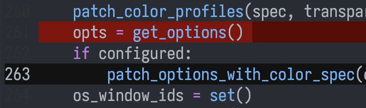
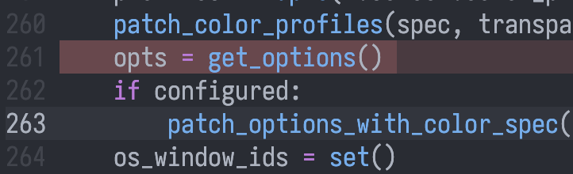
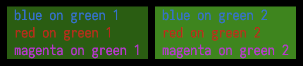
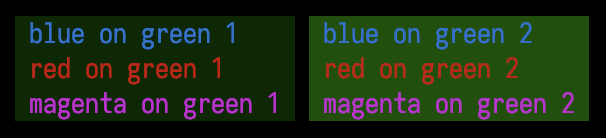
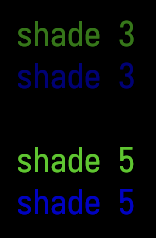
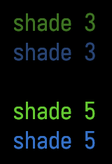
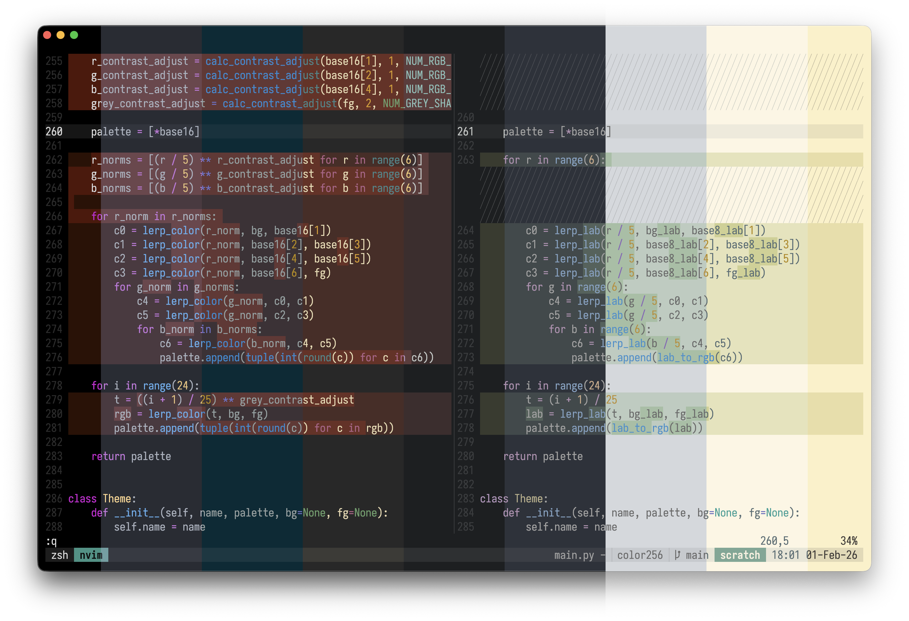

Generating the 256-Color Palette
================================

Terminals should generate the 256-color palette from the user's
base16 theme.

If you've spent much time in the terminal, you've probably set a
custom base16 theme. They work well. You define a handful of colors
in one place and all your programs use them.

The drawback is that 16 colors is limiting. Complex and color-heavy
programs struggle with such a small palette.

The mainstream solution is to use truecolor and gain access to 16
million colors. But there are drawbacks:

- Each truecolor program needs its own theme configuration.
- Changing your color scheme means editing multiple config files.
- Light/dark switching requires explicit support from program maintainers.
- Truecolor escape codes are longer and slower to parse.

The 256-color palette sits in the middle with more range than base16
and less overhead than truecolor. But it has its own issues:

- The default theme clashes with most base16 themes.
- The default theme has poor readability and inconsistent contrast.
- Nobody wants to manually define 240 additional colors.

The solution is to generate the extended palette from your existing
base16 colors. You keep the simplicity of theming in one place while
gaining access to many more colors.

If terminals did this automatically then terminal program maintainers
would consider the 256-color palette a viable choice, allowing them
to use a more expressive color range without requiring added
complexity or configuration files.

Understanding the 256-Color Palette
-----------------------------------

The 256-color palette has a specific layout. If you are already
familiar with it, you can skip to the next section.

The Base 16 Colors
~~~~~~~~~~~~~~~~~~

The first 16 colors form the base16 palette. It contains black,
white, and all primary and secondary colors, each with normal and
bright variants.

0. black
1. red
2. green
3. yellow
4. blue
5. magenta
6. cyan
7. white
8. bright black
9. bright red
10. bright green
11. bright yellow
12. bright blue
13. bright magenta
14. bright cyan
15. bright white

The 216-Color Cube
~~~~~~~~~~~~~~~~~~

The next 216 colors form a 6x6x6 color cube. It works like 24-bit
RGB but with 6 shades per channel instead of 256.

You can calculate a specific index using this formula, where R, G,
and B range from 0 to 5::

    16 + (36 * R) + (6 * G) + B

The Grayscale Ramp
~~~~~~~~~~~~~~~~~~

The final 24 colors form a grayscale ramp between black and white.
Pure black and white themselves are excluded since they can be found
in the color cube at (0, 0, 0) and (5, 5, 5).

You can calculate a specific index using this formula, where S is the
shade ranging from 0 to 23::

    232 + S

Problems with the 256-Color Palette
-----------------------------------

Base16 Clash
~~~~~~~~~~~~

The most obvious problem with the 256-color palette is the inconsistency
with the user's base16 theme:

Using a custom 256-color palette gives a more pleasing result:

Incorrect Interpolation
~~~~~~~~~~~~~~~~~~~~~~~

The default 216-color cube interpolates between black and each color
incorrectly. It is shifted towards lighter shades (37% intensity
for the first non-black shade as opposed to the expected 20%), causing
readability issues when attempting to use dark shades as background:

If the color cube is instead interpolated correctly, readability
is preserved:

Inconsistent Contrast
~~~~~~~~~~~~~~~~~~~~~

The default 256-color palette uses fully saturated colors, leading
to inconsistent brightness against the black background. Notice
that blue always appears darker than green, despite having the same
shade:

If a less saturated blue is used instead then the consistent
brightness is preserved:

Generating the Palette
----------------------

These problems can be solved by generating the 256-color palette
from the user's base16 colors.

The base16 palette has 8 normal colors which map to the 8 corners
of the 216-color cube. The terminal foreground and background should
be used instead of the base16 black and white.

These colors can be used to construct the 216-color cube via trilinear
interpolation, and the grayscale ramp with a simple background to
foreground interpolation.

The LAB colorspace should be used to achieve consistent apparent
brightness across hues of the same shade.

**Solarized with RGB interpolation:**

**Solarized with LAB interpolation:**

Below is a combined image of many generated themes:

Implementation
~~~~~~~~~~~~~~

This code is public domain, intended to be modified and used anywhere
without friction.

.. code-block:: python

    def lerp_lab(t, lab1, lab2):
        return (
            lab1[0] + t * (lab2[0] - lab1[0]),
            lab1[1] + t * (lab2[1] - lab1[1]),
            lab1[2] + t * (lab2[2] - lab1[2]),
        )

    def generate_256_palette(base16, bg=None, fg=None):
        base8_lab = [rgb_to_lab(c) for c in base16[:8]]
        bg_lab = rgb_to_lab(bg) if bg else base8_lab[0]
        fg_lab = rgb_to_lab(fg) if fg else base8_lab[7]

        palette = [*base16]

        for r in range(6):
            c0 = lerp_lab(r / 5, bg_lab, base8_lab[1])
            c1 = lerp_lab(r / 5, base8_lab[2], base8_lab[3])
            c2 = lerp_lab(r / 5, base8_lab[4], base8_lab[5])
            c3 = lerp_lab(r / 5, base8_lab[6], fg_lab)
            for g in range(6):
                c4 = lerp_lab(g / 5, c0, c1)
                c5 = lerp_lab(g / 5, c2, c3)
                for b in range(6):
                    c6 = lerp_lab(b / 5, c4, c5)
                    palette.append(lab_to_rgb(c6))

        for i in range(24):
            t = (i + 1) / 25
            lab = lerp_lab(t, bg_lab, fg_lab)
            palette.append(lab_to_rgb(lab))

        return palette

Conclusion
----------

The default 256-color palette has room for improvement. Considering
its poor readability and its clash with the user's theme, program
authors avoid it, opting for the less expressive base16 or more
complex truecolor.

Terminals should generate the 256-color palette from the user's
base16 theme. This would make the palette a viable option especially
considering its advantages over truecolor:

- Access to a wide color palette without needing config files.
- Light/dark switching capability without developer effort.
