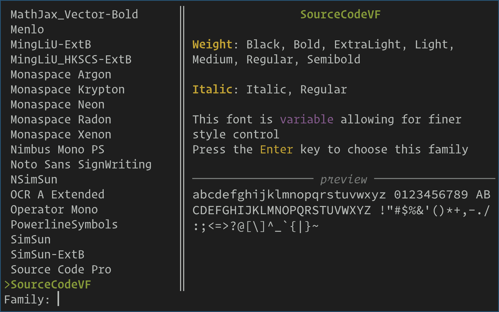
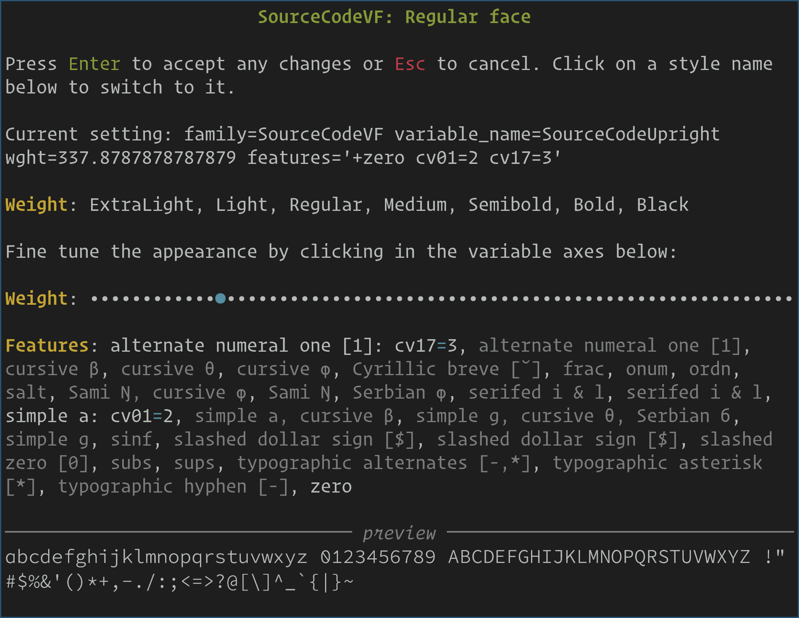

Changing kitty fonts
========================

.. only:: man

    Overview
    --------------

Terminal aficionados spend all day staring at text, as such, getting text
rendering just right is very important. kitty has extremely powerful facilities
for fine-tuning text rendering. It supports `OpenType features
<https://en.wikipedia.org/wiki/List_of_typographic_features>`__ to select
alternate glyph shapes, and `Variable fonts
<https://en.wikipedia.org/wiki/Variable_font>`__ to control the weight or
spacing of a font precisely. You can also :opt:`select which font is used to
render particular unicode codepoints <symbol_map>` and you can :opt:`modify
font metrics <modify_font>` and even :opt:`adjust the gamma curves
<text_composition_strategy>` used for rendering text onto the background color.

The first step is to select the font faces kitty will use for rendering
regular, bold and italic text. kitty comes with a convenient UI for choosing fonts,
in the form of the *choose-fonts* kitten. Simply run::

    kitten choose-fonts

and follow the on screen prompts.

First, choose the family you want, the list of families can be easily filtered by
typing a few letters from the family name you are looking for. The family
selection screen shows you a preview of how the family looks.

Once you select a family by pressing the :kbd:`Enter` key, you
are shown previews of what the regular, bold and italic faces look like
for that family. You can choose to fine tune any of the faces. Start with
fine-tuning the regular face by pressing the :kbd:`R` key. The other styles
will be automatically adjusted based on what you select for the regular face.

You can choose a specific style or font feature by clicking on it. A precise
value for any variable axes can be selected using the slider, in the screenshot
above, the font supports precise weight adjustment. If you are lucky the font
designer has included descriptive names for font features, which will be
displayed, if not, consult the documentation of the font to see what each feature does.

.. _font_spec_syntax:

The font specification syntax
--------------------------------

If you don't like the choose fonts kitten or simply want to understand and
write font selection options into :file:`kitty.conf` yourself, read on.

There are four font face selection keys: `font_family`, `bold_font`,
`italic_font` and `bold_italic_font`. Each of these supports the syntax
described below. Their values can be of three types, either a
font family name, the keyword ``auto`` or an extended ``key=value`` syntax
for specifying font selection precisely.

If a font family name is specified kitty will use Operating System APIs to
search for a matching font. The keyword ``auto`` means kitty will choose a font
completely automatically, typically this is used for automatically selecting
bold/italic variants once the :opt:`font_family` is set. The bold and italic
variants will then automatically use the same set of features as the main face.

To specify font face selection more precisely, a ``key=value`` syntax is used.
First, let's look at a few examples::

    # Select by family only, actual face selection is automatic
    font_family family="Fira Code"
    # Select an exact face by Postscript name
    font_family postscript_name=FiraCode
    # Select an exact face by family with features and variable weight
    font_family family=SourceCodeVF variable_name=SourceCodeUpright features="+zero cv01=2" wght=380

The following are the known keys, any other keys are names of *variable axes*,
that is, they are used to set the variable value for some font characteristic.

``family``
    A font family name. A family typically has multiple actual font faces, such
    as bold and italic variants. One or more of the faces can even be variable,
    allowing fine tuning of font characteristics.

``style``
    A style name to choose a particular font from a given family. Useful only
    with the ``family`` key, when no more precise methods for face selection
    are specified. Can also be used to specify a named variable style for
    variable fonts.

``postscript_name``
    The actual postscript name for a font face. This allows selecting a
    particular variant within a font family. But note that postscript names
    are usually insufficient for selecting variable fonts.

``full_name``
    This can be used to select a particular font face in a family. However, it
    is less precise than ``postscript_name`` and should not generally be used.

``variable_name``
    Some families with variable fonts actually contain multiple font files. For
    example, a family could have variable weights with one font file containing
    upright variable weight faces and another containing italic variable weight
    faces. Well designed fonts use a *variable name* to distinguish between
    such files. Should be used in conjunction with ``family`` to select a
    particular variable font file.

``features``
    A space separated list of OpenType font features to enable/disable or
    select a value of, for this font. Consult the documentation for the font
    family to see what features it supports and their effects. The exact syntax
    for specifying features is `documented by HarfBuzz
    <https://harfbuzz.github.io/harfbuzz-hb-common.html#hb-feature-from-string>`__

``system``
    This can be used to pass an arbitrary string, usually a family or full name
    to the OS font selection APIs. Should not be used in conjunction with any
    other keys. Is the same as specifying just the font name without any keys.

In addition to these keys, any four letter key is treated as the name of a
variable characteristic of the font. Its value is used to set the value for
the name.
