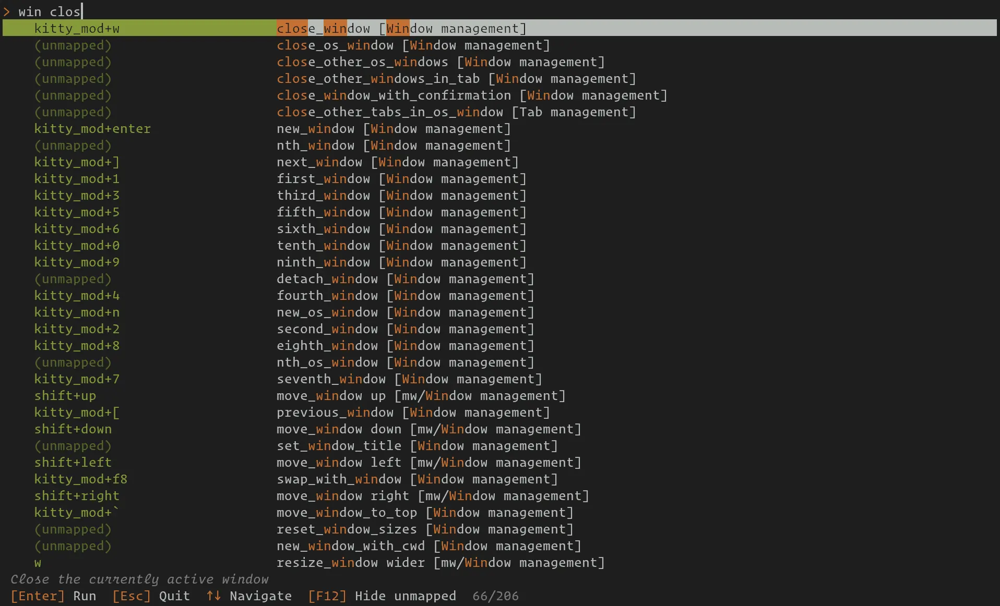

Command palette
=================

.. only:: man

    Overview
    --------------

The command palette lets you browse, search and trigger all keyboard shortcuts
and actions in |kitty| from a single searchable overlay. Press
:sc:`command_palette` to open it (default: :kbd:`Ctrl+Shift+F3`).

    The command palette showing search results for ``win close``.

All mapped actions (those with a keyboard shortcut) and unmapped actions (those
available but not bound to any key) are listed, organized by category. Mouse
bindings are shown in a separate section. Simply type to search, select a
result, and press :kbd:`Enter` to run it.

Searching
-----------

As you type into the search bar, the palette filters results in real time.
Matching is case-insensitive and works across three columns simultaneously:
the **key** (keyboard shortcut), the **action** name, and the **category**.
Matched characters are highlighted so you can see exactly where each term hit.

**Multiple words**
    Separate your terms with spaces. Typing ``scroll page`` looks for items
    that contain *scroll* and *page* anywhere across the key, action, or
    category columns. Items that match more of your terms are ranked higher
    than those that match fewer.

**How individual words are matched**
    Each word in your query is compared against every word in the three
    columns. The best match wins and determines the item's score for that
    term:

    - *Exact word* — the query word equals a column word exactly (highest score).
    - *Prefix* — the column word starts with the query word,
      e.g. ``scr`` matches ``scroll``.
    - *Typo tolerance* — for words of four characters or longer, a single
      typo (one character inserted, deleted, or substituted) still produces a
      match, and two typos give a lower-scoring match.

    An item appears in the results as long as at least one query word matches
    something. Items where more query words match rank above those where fewer
    match.

**Compound names**
    Delimiters such as ``_``, ``+``, ``/``, and ``-`` are kept intact inside a
    query word, so you can search for compound action names as a unit.
    Typing ``mouse_selection`` first tries to find that exact substring in each
    column. If that fails, it splits the token into its parts (``mouse`` and
    ``selection``) and matches each part independently against the column words.

**Ranking**
    When multiple items match the same query, they are sorted by:

    1. Number of query words that matched (more is better).
    2. Score on the action column (action matches outrank key or category matches).
    3. Score on the key column.
    4. Score on the category column.
    5. Shorter action name as a tiebreaker (more specific results first).

Keyboard controls
-------------------

The following keys are available while the command palette is open:

.. list-table::
    :widths: auto
    :header-rows: 1

    * - Key
      - Action
    * - Any text
      - Filter results by typing a search query
    * - :kbd:`Enter`
      - Run the selected action
    * - :kbd:`Escape`
      - Clear the search query, or close the palette if the query is already empty
    * - :kbd:`Up` / :kbd:`Ctrl+K` / :kbd:`Ctrl+P`
      - Move selection up
    * - :kbd:`Down` / :kbd:`Ctrl+J` / :kbd:`Ctrl+N`
      - Move selection down
    * - :kbd:`Page Up`
      - Move selection up by a page
    * - :kbd:`Page Down`
      - Move selection down by a page
    * - :kbd:`Home`
      - Jump to the first result
    * - :kbd:`End`
      - Jump to the last result
    * - :kbd:`Backspace`
      - Delete the last character from the query
    * - :kbd:`F12`
      - Toggle display of unmapped actions
    * - Mouse click
      - Select and run the clicked action

Unmapped actions
------------------

By default, the palette shows both mapped actions (those bound to a shortcut)
and unmapped actions (those with no shortcut assigned). Unmapped actions appear
with an ``(unmapped)`` label in the key column. Press :kbd:`F12` to toggle
their visibility. This preference is remembered across sessions.

Unmapped actions are useful for discovering functionality that you may not have
configured a shortcut for. You can run them directly from the palette, or note
the action name and add a mapping in :file:`kitty.conf`.

Custom keyboard modes
-----------------------

If you have defined custom :ref:`keyboard modes <modal_mappings>` in your
configuration, their bindings appear under separate mode headers in the palette.
The ``push_keyboard_mode`` bindings are grouped with the target mode they
activate, making it easy to see how to enter each mode alongside its shortcuts.

Configuration
--------------

The default mapping to open the command palette is::

    map kitty_mod+f3 command_palette

You can change this in :file:`kitty.conf` like any other mapping. For example::

    map ctrl+p command_palette
