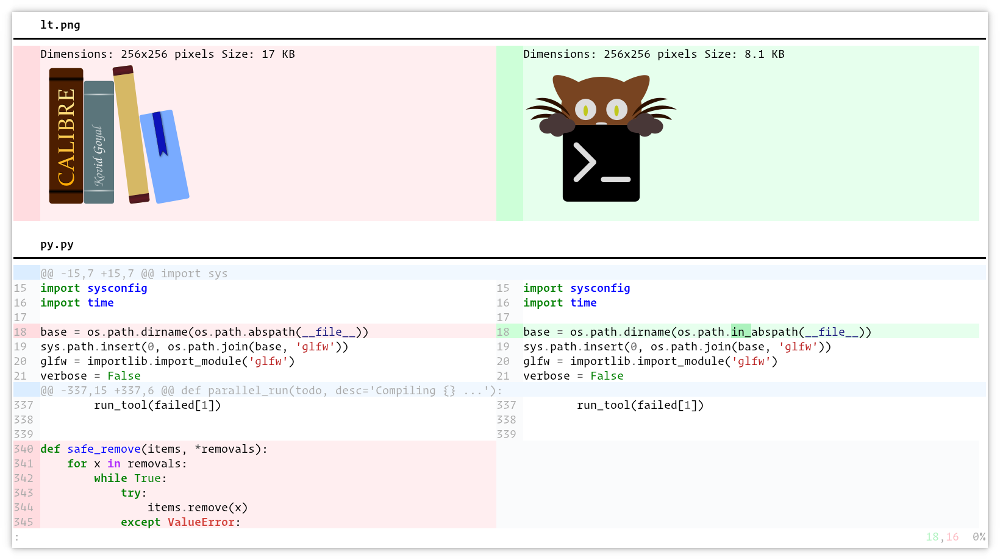

kitty-diff
================================================================================

*A fast side-by-side diff tool with syntax highlighting and images*

.. highlight:: sh

Major Features
-----------------

.. container:: major-features

    * Displays diffs side-by-side in the kitty terminal

    * Does syntax highlighting of the displayed diffs, asynchronously, for
      maximum speed

    * Displays images as well as text diffs, even over SSH

    * Does recursive directory diffing

   Screenshot, showing a sample diff

Installation
---------------

Simply :ref:`install kitty <quickstart>`.  You also need to have either the `git
<https://git-scm.com/>`__ program or the :program:`diff` program installed.
Additionally, for syntax highlighting to work, `pygments
<https://pygments.org/>`__ must be installed (note that pygments is included in
the official kitty binary builds).

Usage
--------

In the kitty terminal, run::

    kitty +kitten diff file1 file2

to see the diff between :file:`file1` and :file:`file2`.

Create an alias in your shell's startup file to shorten the command, for
example:

.. code-block:: sh

    alias d="kitty +kitten diff"

Now all you need to do to diff two files is::

    d file1 file2

You can also pass directories instead of files to see the recursive diff of the
directory contents.

Keyboard controls
----------------------

=========================   ===========================
Action                      Shortcut
=========================   ===========================
Quit                        :kbd:`Q`, :kbd:`Ctrl+C`, :kbd:`Esc`
Scroll line up              :kbd:`K`, :kbd:`Up`
Scroll line down            :kbd:`J`, :kbd:`Down`
Scroll page up              :kbd:`PgUp`
Scroll page down            :kbd:`PgDn`
Scroll to top               :kbd:`Home`
Scroll to bottom            :kbd:`End`
Scroll to next page         :kbd:`Space`, :kbd:`PgDn`
Scroll to previous page     :kbd:`PgUp`
Scroll to next change       :kbd:`N`
Scroll to previous change   :kbd:`P`
Increase lines of context   :kbd:`+`
Decrease lines of context   :kbd:`-`
All lines of context        :kbd:`A`
Restore default context     :kbd:`=`
Search forwards             :kbd:`/`
Search backwards            :kbd:`?`
Clear search                :kbd:`Esc`
Scroll to next match        :kbd:`>`, :kbd:`.`
Scroll to previous match    :kbd:`<`, :kbd:`,`
=========================   ===========================

Integrating with git
-----------------------

Add the following to :file:`~/.gitconfig`:

.. code-block:: ini

    [diff]
        tool = kitty
        guitool = kitty.gui
    [difftool]
        prompt = false
        trustExitCode = true
    [difftool "kitty"]
        cmd = kitty +kitten diff $LOCAL $REMOTE
    [difftool "kitty.gui"]
        cmd = kitty kitty +kitten diff $LOCAL $REMOTE

Now to use kitty-diff to view git diffs, you can simply do::

    git difftool --no-symlinks --dir-diff

Once again, creating an alias for this command is useful.

Why does this work only in kitty?
----------------------------------------

The diff kitten makes use of various features that are :doc:`kitty only
</protocol-extensions>`, such as the :doc:`kitty graphics protocol
</graphics-protocol>`, the :doc:`extended keyboard protocol
</keyboard-protocol>`, etc. It also leverages terminal program infrastructure
I created for all of kitty's other kittens to reduce the amount of code needed
(the entire implementation is under 2000 lines of code).

And fundamentally, it's kitty only because I wrote it for myself, and I am
highly unlikely to use any other terminals :)

Configuration
------------------------

You can configure the colors used, keyboard shortcuts, the diff implementation,
the default lines of context, etc. by creating a :file:`diff.conf` file in your
:ref:`kitty config folder <confloc>`. See below for the supported configuration
directives.

.. include:: /generated/conf-kitten-diff.rst

.. include:: /generated/cli-kitten-diff.rst

Sample diff.conf
-----------------

You can download a sample :file:`diff.conf` file with all default settings and
comments describing each setting by clicking: :download:`sample diff.conf
</generated/conf/diff.conf>`.
