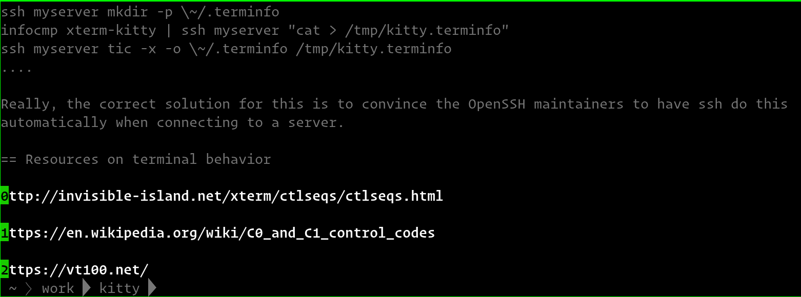

Hints
==========

|kitty| has a *hints mode* to select and act on arbitrary text snippets
currently visible on the screen.  For example, you can press :sc:`open_url`
to choose any URL visible on the screen and then open it using your default web
browser.

    URL hints mode

Similarly, you can press :sc:`insert_selected_path` to select anything that
looks like a path or filename and then insert it into the terminal, very useful
for picking files from the output of a :program:`git` or :program:`ls` command
and adding them to the command line for the next command.

You can also press :sc:`goto_file_line` to select anything that looks like a
path or filename followed by a colon and a line number and open the file in
:program:`vim` at the specified line number. The patterns and editor to be used
can be modified using options passed to the kitten. For example::

    map ctrl+g kitten hints --type=linenum --linenum-action=tab nvim +{line} {path}

will open the selected file in a new tab inside `Neovim <https://neovim.io/>`__
when you press :kbd:`Ctrl+G`.

Pressing :sc:`open_selected_hyperlink` will open :term:`hyperlinks`, i.e. a URL
that has been marked as such by the program running in the terminal,
for example, by ``ls --hyperlink=auto``. If :program:`ls` comes with your OS
does not support hyperlink, you may need to install `GNU Coreutils
<https://www.gnu.org/software/coreutils/>`__.

You can also :doc:`customize what actions are taken for different types of URLs
<../open_actions>`.

.. note:: If there are more hints than letters, hints will use multiple
   letters. In this case, when you press the first letter, only hints
   starting with that letter are displayed. Pressing the second letter will
   select that hint or press :kbd:`Enter` or :kbd:`Space` to select the empty
   hint.

The hints kitten is very powerful to see more detailed help on its various
options and modes of operation, see below. You can use these options to
create mappings in :file:`kitty.conf` to select various different text
snippets. See :sc:`insert_selected_path <insert_selected_path>` for examples.

Completely customizing the matching and actions of the kitten
---------------------------------------------------------------

The hints kitten supports writing simple Python scripts that can be used to
completely customize how it finds matches and what happens when a match is
selected. This allows the hints kitten to provide the user interface, while you
can provide the logic for finding matches and performing actions on them. This
is best illustrated with an example. Create the file :file:`custom-hints.py` in
the :ref:`kitty config directory <confloc>` with the following contents:

.. code-block:: python

    import re

    def mark(text, args, Mark, extra_cli_args, *a):
        # This function is responsible for finding all
        # matching text. extra_cli_args are any extra arguments
        # passed on the command line when invoking the kitten.
        # We mark all individual word for potential selection
        for idx, m in enumerate(re.finditer(r'\w+', text)):
            start, end = m.span()
            mark_text = text[start:end].replace('\n', '').replace('\0', '')
            # The empty dictionary below will be available as groupdicts
            # in handle_result() and can contain string keys and arbitrary JSON
            # serializable values.
            yield Mark(idx, start, end, mark_text, {})

    def handle_result(args, data, target_window_id, boss, extra_cli_args, *a):
        # This function is responsible for performing some
        # action on the selected text.
        # matches is a list of the selected entries and groupdicts contains
        # the arbitrary data associated with each entry in mark() above
        matches, groupdicts = [], []
        for m, g in zip(data['match'], data['groupdicts']):
            if m:
                matches.append(m), groupdicts.append(g)
        for word, match_data in zip(matches, groupdicts):
            # Lookup the word in a dictionary, the open_url function
            # will open the provided url in the system browser
            boss.open_url(f'https://www.google.com/search?q=define:{word}')

Now run kitty with::

    kitty -o 'map f1 kitten hints --customize-processing custom-hints.py'

When you press the :kbd:`F1` key you will be able to select a word to
look it up in the Google dictionary.

.. include:: ../generated/cli-kitten-hints.rst

.. note::

    To avoid having to specify the same command line options on every
    invocation, you can use the :opt:`action_alias` option in
    :file:`kitty.conf`, creating aliases that have common sets of options.
    For example::

        action_alias myhints kitten hints --alphabet qfjdkslaureitywovmcxzpq1234567890
        map f1 myhints --customize-processing custom-hints.py
