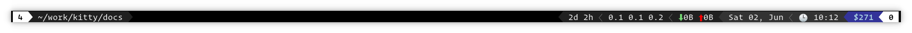

Draw a GPU accelerated dock panel on your desktop
====================================================================================================

.. highlight:: sh

You can use this kitten to draw a GPU accelerated panel on the edge of your
screen, that shows the output from an arbitrary terminal program.

It is useful for showing status information or notifications on your desktop
using terminal programs instead of GUI toolkits.

   Screenshot, showing a sample panel

The screenshot above shows a sample panel that displays the current desktop and
window title as well as miscellaneous system information such as network
activity, CPU load, date/time, etc.

.. note::

    This kitten currently only works on X11 desktops

Using this kitten is simple, for example::

    kitty +kitten panel sh -c 'printf "\n\n\nHello, world."; sleep 5s'

This will show ``Hello, world.`` at the top edge of your screen for five
seconds. Here the terminal program we are running is :program:`sh` with a script
to print out ``Hello, world!``. You can make the terminal program as complex as
you like, as demonstrated in the screenshot above.

.. include:: ../generated/cli-kitten-panel.rst
