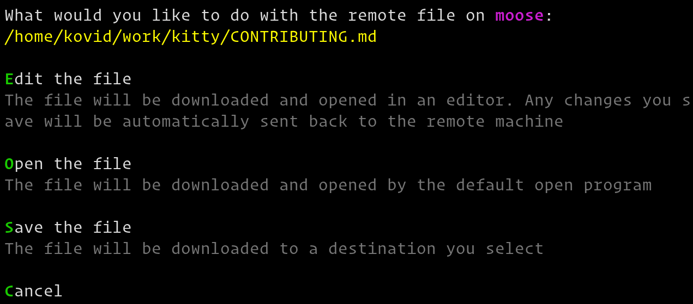

Remote files
==============

|kitty| has the ability to easily *Edit*, *Open* or *Download* files
from a computer into which you are SSHed. In your SSH session run::

    ls --hyperlink=auto

Then hold down :kbd:`ctrl+shift` and click the name of the file.

    Remote file actions

|kitty| will ask you what you want to do with the remote file. You can choose
to *Edit* it in which case kitty will download it and open it locally in your
``EDITOR``. As you make changes to the file, they are automatically transferred
to the remote computer. Note that this happens without needing to install *any*
special software on the server, beyond ``ls`` that supports hyperlinks.

.. versionadded:: 0.19.0

.. note::
   Nested SSH sessions are not supported. The kitten will always try to copy
   remote files from the first SSH host. This is because there is no way for
   |kitty| to detect and follow a nested SSH session robustly.

.. note::
   If you have not setup automatic password-less SSH access, then, when
   editing starts you will be asked to enter your password just once,
   thereafter the SSH connection will be re-used.

Similarly, you can choose to save the file to the local computer or download
and open it in its default file handler.
