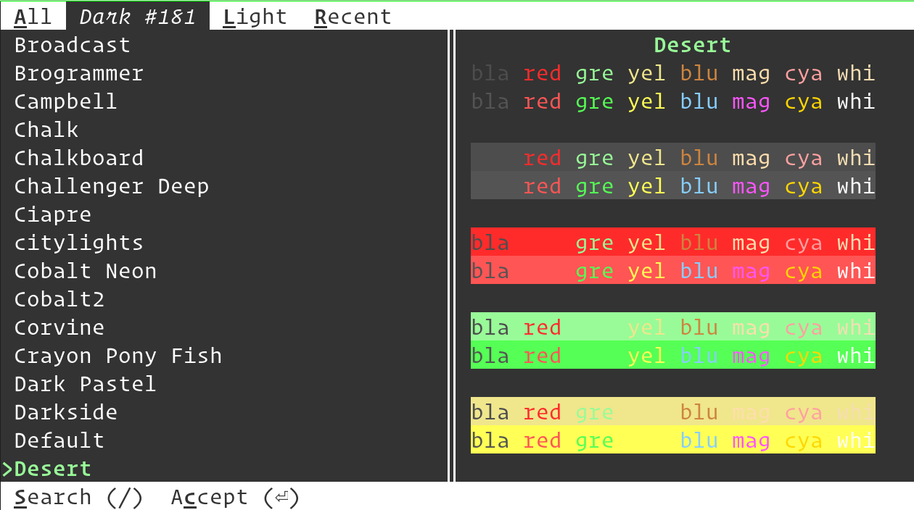

Changing kitty colors
========================

The themes kitten allows you to easily change color themes, from a collection of
over two hundred pre-built themes available at `kitty-themes
<https://github.com/kovidgoyal/kitty-themes>`_. To use it, simply run::

    kitty +kitten themes

The kitten allows you to pick a theme, with live previews of the colors. You can
choose between light and dark themes and search by theme name by just typing a
few characters from the name.

The kitten maintains a list of recently used themes to allow quick switching.

If you want to restore the colors to default, you can do so by choosing the
``Default`` theme.

.. versionadded:: 0.23.0
   The themes kitten

How it works
----------------

A theme in kitty is just a :file:`.conf` file containing kitty settings.
When you select a theme, the kitten simply copies the :file:`.conf` file
to :file:`~/.config/kitty/current-theme.conf` and adds an include for
:file:`current-theme.conf` to :file:`kitty.conf`. It also comments out any
existing color settings in :file:`kitty.conf` so they do not interfere.

Once that's done, the kitten sends kitty a signal to make it reload its config.

Using your own themes
-----------------------

You can also create your own themes as :file:`.conf` files. Put them in the
:file:`themes` sub-directory of the :ref:`kitty config directory <confloc>`,
usually, :file:`~/.config/kitty/themes`. The kitten will automatically add them
to the list of themes. You can use this to modify the builtin themes, by giving
the conf file the name :file:`Some theme name.conf` to override the builtin
theme of that name. Note that after doing so you have to run the kitten and
choose that theme once for your changes to be applied.

Contributing new themes
-------------------------

If you wish to contribute a new theme to the kitty theme repository, start by
going to the `kitty-themes <https://github.com/kovidgoyal/kitty-themes>`__
repository. `Fork it
<https://docs.github.com/en/get-started/quickstart/fork-a-repo>`__, and use the
file :download:`template.conf
<https://github.com/kovidgoyal/kitty-themes/raw/master/template.conf>` as a
template when creating your theme. Once you are satisfied with how it looks,
`submit a pull request
<https://docs.github.com/en/pull-requests/collaborating-with-pull-requests/proposing-changes-to-your-work-with-pull-requests/creating-a-pull-request>`__
to have your theme merged into the `kitty-themes
<https://github.com/kovidgoyal/kitty-themes>`__ repository, which will make it
available in this kitten automatically.

Changing the theme non-interactively
---------------------------------------

You can specify the theme name as an argument when invoking the kitten to have
it change to that theme instantly. For example::

    kitty +kitten themes --reload-in=all Dimmed Monokai

Will change the theme to ``Dimmed Monokai`` in all running kitty instances. See
below for more details on non-interactive operation.

.. include:: ../generated/cli-kitten-themes.rst
