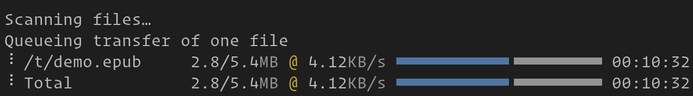

Transfer files
================

.. only:: man

    Overview
    --------------

.. versionadded:: 0.30.0

.. _rsync: https://en.wikipedia.org/wiki/Rsync

Transfer files to and from remote computers over the ``TTY`` device itself.
This means that file transfer works over nested SSH sessions, serial links,
etc. Anywhere you have a terminal device, you can transfer files.

This kitten supports transferring entire directory trees, preserving soft and
hard links, file permissions, times, etc. It even supports the rsync_ protocol
to transfer only changes to large files.

.. seealso:: See the :doc:`remote_file` kitten

Basic usage
---------------

Simply ssh into a remote computer using the :doc:`ssh kitten </kittens/ssh>` and run the this kitten
(which the ssh kitten makes available for you on the remote computer
automatically). Some illustrative examples are below. To copy a file from a
remote computer::

    <local computer>  $ kitten ssh my-remote-computer
    <remote computer> $ kitten transfer some-file /path/on/local/computer

This, will copy :file:`some-file` from the computer into which you have SSHed
to your local computer at :file:`/path/on/local/computer`. kitty will ask you
for confirmation before allowing the transfer, so that the file transfer
protocol cannot be abused to read/write files on your computer.

To copy a file from your local computer to the remote computer::

    <local computer>  $ kitten ssh my-remote-computer
    <remote computer> $ kitten transfer --direction=upload /path/on/local/computer remote-file

For more detailed usage examples, see the command line interface section below.

.. note::
   If you dont want to use the ssh kitten, you can install the kitten binary on
   the remote machine yourself, it is a standalone, statically compiled binary
   available from the `kitty releases page
   <https://github.com/kovidgoyal/kitty/releases>`__. Or you can write your own
   script/program to use the underlying :doc:`file transfer protocol
   </file-transfer-protocol>`.

Avoiding the confirmation prompt
------------------------------------

Normally, when you start a file transfer kitty will prompt you for confirmation.
This is to ensure that hostile programs running on a remote machine cannot
read/write files on your computer without your permission. If the remote machine
is trusted, then you can disable the confirmation prompt by:

#. Setting the :opt:`file_transfer_confirmation_bypass` option to some password.

#. When invoking the kitten use the :option:`--permissions-bypass
   <kitty +kitten transfer --permissions-bypass>` to supply the password you set
   in step one.

.. warning:: Using a password to bypass confirmation means any software running
   on the remote machine could potentially learn that password and use it to
   gain full access to your computer.

Delta transfers
-----------------------------------

This kitten has the ability to use the rsync_ protocol to only transfer the
differences between files. To turn it on use the :option:`--transmit-deltas
<kitty +kitten transfer --transmit-deltas>` option. Note that this will
actually be slower when transferring small files or on a very fast network, because
of round trip overhead, so use with care.

.. include:: ../generated/cli-kitten-transfer.rst
