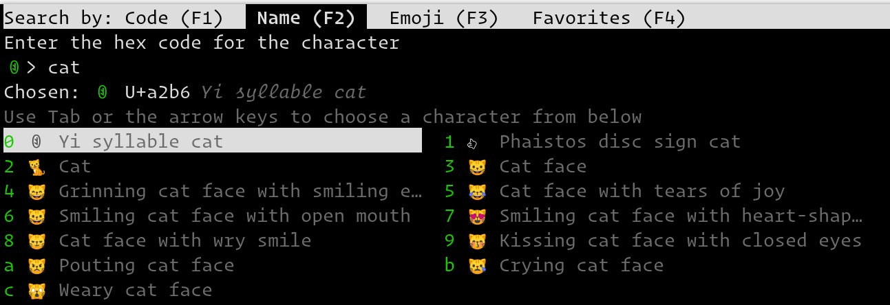

Unicode input
================

.. only:: man

    Overview
    --------------

You can input Unicode characters by name, hex code, recently used and even an
editable favorites list. Press :sc:`input_unicode_character` to start the
unicode input kitten, shown below.

    A screenshot of the unicode input kitten

In :guilabel:`Code` mode, you enter a Unicode character by typing in the hex
code for the character and pressing :kbd:`Enter`. For example, type in ``2716``
and press :kbd:`Enter` to get ``✖``. You can also choose a character from the
list of recently used characters by typing a leading period ``.`` and then the
two character index and pressing :kbd:`Enter`.
The :kbd:`Up` and :kbd:`Down` arrow keys can be used to choose the previous and
next Unicode symbol respectively.

In :guilabel:`Name` mode you instead type words from the character name and use
the :kbd:`ArrowKeys` / :kbd:`Tab` to select the character from the displayed
matches. You can also type a space followed by a period and the index for the
match if you don't like to use arrow keys.

You can switch between modes using either the keys :kbd:`F1` ... :kbd:`F4` or
:kbd:`Ctrl+1` ... :kbd:`Ctrl+4` or by pressing :kbd:`Ctrl+[` and :kbd:`Ctrl+]`
or by pressing :kbd:`Ctrl+Tab` and :kbd:`Ctrl+Shift+Tab`.

.. include:: ../generated/cli-kitten-unicode_input.rst
