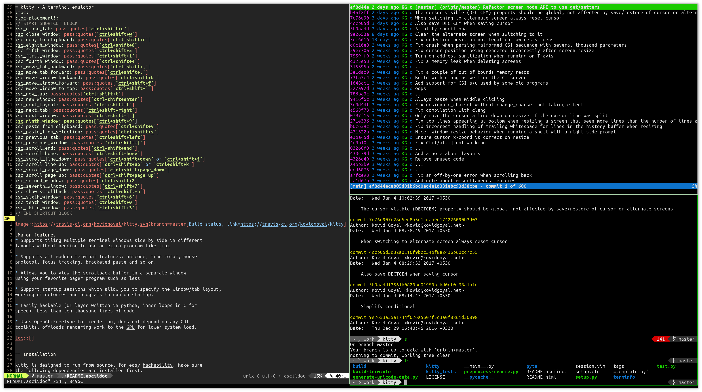
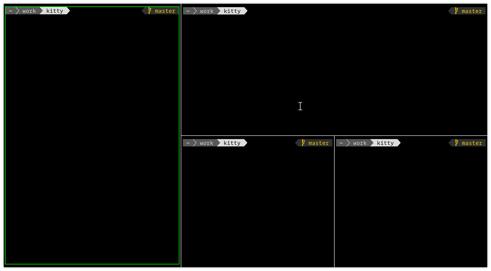

Arrange windows
-------------------

kitty has the ability to define its own windows that can be tiled next to each
other in arbitrary arrangements, based on *Layouts*, see below for examples:

    Screenshot, showing :program:`vim`, :program:`tig` and :program:`git`
    running in |kitty| with the *Tall* layout

    Screenshot, showing windows with arbitrary arrangement in the *Splits*
    layout

There are many different layouts available. They are all enabled by default, you
can switch layouts using :ac:`next_layout` (:sc:`next_layout` by default). To
control which layouts are available use :opt:`enabled_layouts`, the first listed
layout becomes the default. Individual layouts and how to use them are described
below.

The Stack Layout
------------------

This is the simplest layout. It displays a single window using all available
space, other windows are hidden behind it. This layout has no options::

    enabled_layouts stack

The Tall Layout
------------------

Displays one (or optionally more) full-height windows on the left half of the
screen. Remaining windows are tiled vertically on the right half of the screen.
There are options to control how the screen is split horizontally ``bias``
(an integer between ``10`` and ``90``) and options to control how many
full-height windows there are ``full_size`` (a positive integer). The
``mirrored`` option when set to ``true`` will cause the full-height windows to
be on the right side of the screen instead of the left. The syntax
for the options is::

    enabled_layouts tall:bias=50;full_size=1;mirrored=false

    ┌──────────────┬───────────────┐
    │              │               │
    │              │               │
    │              │               │
    │              ├───────────────┤
    │              │               │
    │              │               │
    │              │               │
    │              ├───────────────┤
    │              │               │
    │              │               │
    │              │               │
    └──────────────┴───────────────┘

In addition, you can map keys to increase or decrease the number of full-height
windows, or toggle the mirrored setting, for example::

   map ctrl+[ layout_action decrease_num_full_size_windows
   map ctrl+] layout_action increase_num_full_size_windows
   map ctrl+/ layout_action mirror toggle
   map ctrl+y layout_action mirror true
   map ctrl+n layout_action mirror false

You can also map a key to change the bias by providing a list of percentages
and it will rotate through the list as you press the key. If you only provide
one number it'll toggle between that percentage and 50, for example::

   map ctrl+. layout_action bias 50 62 70
   map ctrl+, layout_action bias 62

The Fat Layout
----------------

Displays one (or optionally more) full-width windows on the top half of the
screen. Remaining windows are tiled horizontally on the bottom half of the
screen. There are options to control how the screen is split vertically ``bias``
(an integer between ``10`` and ``90``) and options to control how many
full-width windows there are ``full_size`` (a positive integer). The
``mirrored`` option when set to ``true`` will cause the full-width windows to be
on the bottom of the screen instead of the top. The syntax for the options is::

    enabled_layouts fat:bias=50;full_size=1;mirrored=false

    ┌──────────────────────────────┐
    │                              │
    │                              │
    │                              │
    │                              │
    ├─────────┬──────────┬─────────┤
    │         │          │         │
    │         │          │         │
    │         │          │         │
    │         │          │         │
    │         │          │         │
    └─────────┴──────────┴─────────┘

This layout also supports the same layout actions as the *Tall* layout, shown above.

The Grid Layout
--------------------

Display windows in a balanced grid with all windows the same size except the
last column if there are not enough windows to fill the grid. This layout has no
options::

    enabled_layouts grid

    ┌─────────┬──────────┬─────────┐
    │         │          │         │
    │         │          │         │
    │         │          │         │
    │         │          │         │
    ├─────────┼──────────┼─────────┤
    │         │          │         │
    │         │          │         │
    │         │          │         │
    │         │          │         │
    └─────────┴──────────┴─────────┘

.. _splits_layout:

The Splits Layout
--------------------

This is the most flexible layout. You can create any arrangement of windows
by splitting existing windows repeatedly. To best use this layout you should
define a few extra key bindings in :file:`kitty.conf`::

    # Create a new window splitting the space used by the existing one so that
    # the two windows are placed one above the other
    map f5 launch --location=hsplit

    # Create a new window splitting the space used by the existing one so that
    # the two windows are placed side by side
    map f6 launch --location=vsplit

    # Create a new window splitting the space used by the existing one so that
    # the two windows are placed side by side if the existing window is wide or
    # one above the other if the existing window is tall.
    map f4 launch --location=split

    # Rotate the current split, changing its split axis from vertical to
    # horizontal or vice versa
    map f7 layout_action rotate

    # Move the active window in the indicated direction
    map shift+up move_window up
    map shift+left move_window left
    map shift+right move_window right
    map shift+down move_window down

    # Move the active window to the indicated screen edge
    map ctrl+shift+up layout_action move_to_screen_edge top
    map ctrl+shift+left layout_action move_to_screen_edge left
    map ctrl+shift+right layout_action move_to_screen_edge right
    map ctrl+shift+down layout_action move_to_screen_edge bottom

    # Switch focus to the neighboring window in the indicated direction
    map ctrl+left neighboring_window left
    map ctrl+right neighboring_window right
    map ctrl+up neighboring_window up
    map ctrl+down neighboring_window down

    # Set the bias of the split containing the currently focused window. The
    # currently focused window will take up the specified percent of its parent
    # window's size.
    map ctrl+. layout_action bias 80

Windows can be resized using :ref:`window_resizing`. You can swap the windows
in a split using the ``rotate`` action with an argument of ``180`` and rotate
and swap with an argument of ``270``.

This layout takes one option, ``split_axis`` that controls whether new windows
are placed into vertical or horizontal splits when a :option:`--location
<launch --location>` is not specified. A value of ``horizontal`` (same as
``--location=vsplit``) means when a new split is created the two windows will
be placed side by side and a value of ``vertical`` (same as
``--location=hsplit``) means the two windows will be placed one on top of the
other. A value of ``auto`` means the axis of the split is chosen automatically
(same as ``--location=split``). By default::

    enabled_layouts splits:split_axis=horizontal

    ┌──────────────┬───────────────┐
    │              │               │
    │              │               │
    │              │               │
    │              ├───────┬───────┤
    │              │       │       │
    │              │       │       │
    │              │       │       │
    │              ├───────┴───────┤
    │              │               │
    │              │               │
    │              │               │
    └──────────────┴───────────────┘

.. versionadded:: 0.17.0
    The Splits layout

The Horizontal Layout
------------------------

All windows are shown side by side. This layout has no options::

    enabled_layouts horizontal

    ┌─────────┬──────────┬─────────┐
    │         │          │         │
    │         │          │         │
    │         │          │         │
    │         │          │         │
    │         │          │         │
    │         │          │         │
    │         │          │         │
    │         │          │         │
    │         │          │         │
    └─────────┴──────────┴─────────┘

The Vertical Layout
-----------------------

All windows are shown one below the other. This layout has no options::

    enabled_layouts vertical

    ┌──────────────────────────────┐
    │                              │
    │                              │
    │                              │
    ├──────────────────────────────┤
    │                              │
    │                              │
    │                              │
    ├──────────────────────────────┤
    │                              │
    │                              │
    │                              │
    └──────────────────────────────┘

.. _window_resizing:

Resizing windows
------------------

You can resize windows inside layouts. Press :sc:`start_resizing_window` (also
:kbd:`⌘+r` on macOS) to enter resizing mode and follow the on-screen
instructions. In a given window layout only some operations may be possible for
a particular window. For example, in the *Tall* layout you can make the first
window wider/narrower, but not taller/shorter. Note that what you are resizing
is actually not a window, but a row/column in the layout, all windows in that
row/column will be resized.

You can also define shortcuts in :file:`kitty.conf` to make the active window
wider, narrower, taller, or shorter by mapping to the :ac:`resize_window`
action, for example::

   map ctrl+left resize_window narrower
   map ctrl+right resize_window wider
   map ctrl+up resize_window taller
   map ctrl+down resize_window shorter 3
   # reset all windows in the tab to default sizes
   map ctrl+home resize_window reset

The :ac:`resize_window` action has a second optional argument to control
the resizing increment (a positive integer that defaults to 1).

Some layouts take options to control their behavior. For example, the *Fat*
and *Tall* layouts accept the ``bias`` and ``full_size`` options to control
how the available space is split up. To specify the option, in :opt:`kitty.conf
<enabled_layouts>` use::

    enabled_layouts tall:bias=70;full_size=2

This will have ``2`` instead of a single tall window, that occupy ``70%``
instead of ``50%`` of available width. ``bias`` can be any number between ``10``
and ``90``.

Writing a new layout only requires about two hundred lines of code, so if there
is some layout you want, take a look at one of the existing layouts in the
`layout <https://github.com/kovidgoyal/kitty/tree/master/kitty/layout>`__
package and submit a pull request!
