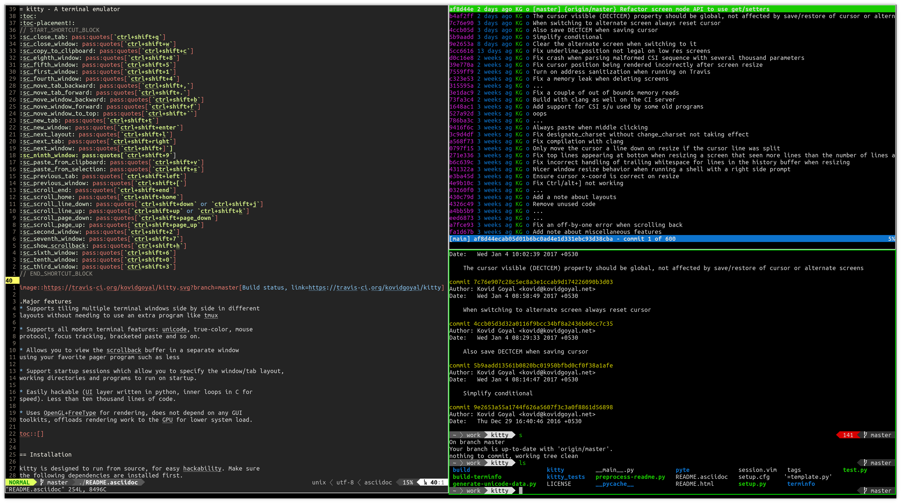
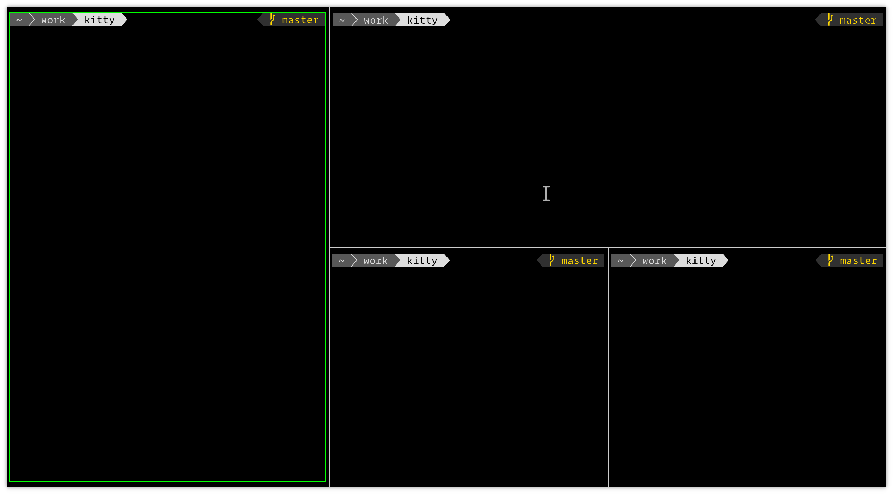

Arrange windows
-------------------

kitty has the ability to define its own windows that can be tiled next to each
other in arbitrary arrangements, based on *Layouts*, see below for examples:

    Screenshot, showing :program:`vim`, :program:`tig` and :program:`git`
    running in |kitty| with the *Tall* layout

    Screenshot, showing windows with arbitrary arrangement in the *Splits*
    layout

There are many different layouts available. They are all enabled by default, you
can switch layouts using :ac:`next_layout` (:sc:`next_layout` by default). To
control which layouts are available use :opt:`enabled_layouts`, the first listed
layout becomes the default. Individual layouts and how to use them are described
below.

.. _docked_windows:

Docked windows
------------------

A dock is a fixed-size kitty window attached to an edge of a tab or another
window. Docks work with every layout and are not part of the layout's normal
tiling topology. This makes them useful for shells, logs, status bars and
other tools that should keep a stable size while the rest of the tab is
rearranged.

Create a dock with :option:`launch --type` set to ``window-dock`` or
``tab-dock`` and choose its edge with :option:`launch --dock-edge`. For example,
these mappings create a shell below the active window and another along the
right edge of the tab::

    map f2 launch --type=window-dock --dock-edge=bottom --dock-size=10 --cwd=current
    map f3 launch --type=tab-dock --dock-edge=right --dock-size=30 --cwd=current

The :option:`launch --dock-size` is measured in rows for top and bottom docks
and columns for left and right docks. It does not include window decorations.
Add a ``%`` suffix, for example ``--dock-size=25%``, to instead size the entire
dock region as a percentage of its parent window or tab along the dock axis.
The default size is one row or column. Multiple docks can be placed on the same
or different edges. If the tab becomes too small to accommodate every requested
size, later-created docks are clipped first so that all geometry remains valid.

There are two dock scopes:

``tab``
    The dock reserves space at the outer edge of the tab before the selected
    layout arranges its normal windows. It remains visible when changing the
    active window, including in the :ref:`Stack Layout <stack_layout>`.

``window``
    The dock subdivides the area allocated to its owner without changing the
    rest of the layout. Its owner is the active normal window by default. Use
    :option:`launch --next-to` to select a different owner. The dock follows
    its owner's visibility, so in the Stack layout it is shown only while its
    owner is shown. Closing the owner group also closes its window docks.

Docks can receive keyboard focus by default. They participate in normal focus
navigation and visual window selection. The :ac:`toggle_dock_focus` action
switches between a normal window and its most recently focused eligible dock;
when run from a dock it returns to the active normal window. A typical mapping
is::

    map f4 toggle_dock_focus

For a display-only dock, use :option:`launch --dock-skip-focus`. Such a dock
cannot become active and is omitted from focus navigation::

    map f5 launch --type=tab-dock --dock-edge=bottom --dock-size=1 --dock-skip-focus my-status-program

Docks cannot be resized, reordered or moved with normal layout actions. Close
them as you would any other window. Their scope, edge, size, focus policy and
ownership are preserved when saving and restoring :doc:`sessions`.

The same options can be used with remote control. This example attaches a
dock to the window matching ID 42::

    kitten @ launch --type=window-dock --next-to=id:42 --dock-edge=left --dock-size=20

See :doc:`launch` for the full launch syntax and option reference.

.. _stack_layout:

The Stack Layout
------------------

This is the simplest layout. It displays a single window using all available
space, other windows are hidden behind it. This layout has no options::

    enabled_layouts stack

The Tall Layout
------------------

Displays one (or optionally more) full-height windows on the left half of the
screen. Remaining windows are tiled vertically on the right half of the screen.
There are options to control how the screen is split horizontally ``bias``
(an integer between ``10`` and ``90``) and options to control how many
full-height windows there are ``full_size`` (a positive integer). The
``mirrored`` option when set to ``true`` will cause the full-height windows to
be on the right side of the screen instead of the left. The syntax
for the options is::

    enabled_layouts tall:bias=50;full_size=1;mirrored=false

    ┌──────────────┬───────────────┐
    │              │               │
    │              │               │
    │              │               │
    │              ├───────────────┤
    │              │               │
    │              │               │
    │              │               │
    │              ├───────────────┤
    │              │               │
    │              │               │
    │              │               │
    └──────────────┴───────────────┘

In addition, you can map keys to increase or decrease the number of full-height
windows, or toggle the mirrored setting, for example::

   map ctrl+[ layout_action decrease_num_full_size_windows
   map ctrl+] layout_action increase_num_full_size_windows
   map ctrl+/ layout_action mirror toggle
   map ctrl+y layout_action mirror true
   map ctrl+n layout_action mirror false

You can also map a key to change the bias by providing a list of percentages
and it will rotate through the list as you press the key. If you only provide
one number it'll toggle between that percentage and 50, for example::

   map ctrl+. layout_action bias 50 62 70
   map ctrl+, layout_action bias 62

The Fat Layout
----------------

Displays one (or optionally more) full-width windows on the top half of the
screen. Remaining windows are tiled horizontally on the bottom half of the
screen. There are options to control how the screen is split vertically ``bias``
(an integer between ``10`` and ``90``) and options to control how many
full-width windows there are ``full_size`` (a positive integer). The
``mirrored`` option when set to ``true`` will cause the full-width windows to be
on the bottom of the screen instead of the top. The syntax for the options is::

    enabled_layouts fat:bias=50;full_size=1;mirrored=false

    ┌──────────────────────────────┐
    │                              │
    │                              │
    │                              │
    │                              │
    ├─────────┬──────────┬─────────┤
    │         │          │         │
    │         │          │         │
    │         │          │         │
    │         │          │         │
    │         │          │         │
    └─────────┴──────────┴─────────┘

This layout also supports the same layout actions as the *Tall* layout, shown above.

The Grid Layout
--------------------

Display windows in a balanced grid with all windows the same size except the
last column if there are not enough windows to fill the grid. This layout has no
options::

    enabled_layouts grid

    ┌─────────┬──────────┬─────────┐
    │         │          │         │
    │         │          │         │
    │         │          │         │
    │         │          │         │
    ├─────────┼──────────┼─────────┤
    │         │          │         │
    │         │          │         │
    │         │          │         │
    │         │          │         │
    └─────────┴──────────┴─────────┘

.. _splits_layout:

The Splits Layout
--------------------

This is the most flexible layout. You can create any arrangement of windows
by splitting existing windows repeatedly. To best use this layout you should
define a few extra key bindings in :file:`kitty.conf`::

    # Create a new window splitting the space used by the existing one so that
    # the two windows are placed one above the other
    map f5 launch --location=hsplit

    # Create a new window splitting the space used by the existing one so that
    # the two windows are placed side by side
    map f6 launch --location=vsplit

    # Create a new window splitting the space used by the existing one so that
    # the two windows are placed side by side if the existing window is wide or
    # one above the other if the existing window is tall.
    map f4 launch --location=split

    # Rotate the current split, changing its split axis from vertical to
    # horizontal or vice versa
    map f7 layout_action rotate

    # Move the active window in the indicated direction
    map shift+up move_window up
    map shift+left move_window left
    map shift+right move_window right
    map shift+down move_window down

    # Move the active window to the indicated screen edge
    map ctrl+shift+up layout_action move_to_screen_edge top
    map ctrl+shift+left layout_action move_to_screen_edge left
    map ctrl+shift+right layout_action move_to_screen_edge right
    map ctrl+shift+down layout_action move_to_screen_edge bottom

    # Switch focus to the neighboring window in the indicated direction
    map ctrl+left neighboring_window left
    map ctrl+right neighboring_window right
    map ctrl+up neighboring_window up
    map ctrl+down neighboring_window down

    # Set the bias of the split containing the currently focused window. The
    # currently focused window will take up the specified percent of its parent
    # window's size.
    map ctrl+. layout_action bias 80

    # Maximize the active window along the horizontal axis (fill full width),
    # keeping other windows visible in their vertical positions. Press again to
    # restore the original layout.
    map ctrl+shift+right layout_action maximize horizontal

    # Maximize the active window along the vertical axis (fill full height),
    # keeping other windows visible in their horizontal positions. Press again
    # to restore the original layout.
    map ctrl+shift+up layout_action maximize vertical

    # Equalize all splits so that windows share available space proportionally.
    map ctrl+shift+e layout_action equalize

Windows can be resized using :ref:`window_resizing`. You can swap the windows
in a split using the ``rotate`` action with an argument of ``180`` and rotate
and swap with an argument of ``270``. The ``maximize`` action expands the active
window to fill the maximum available space along a single axis while keeping
the rest of the layout intact. Use ``maximize horizontal`` to fill the full
width and ``maximize vertical`` to fill the full height. Calling it again
restores the original split sizes. The ``equalize`` action redistributes space
so that all windows along each split axis receive an equal share.

This layout takes three options. ``equalize_on_window_close`` automatically equalizes
split sizes whenever a window is closed, keeping remaining windows balanced
without needing an explicit keybinding::

    enabled_layouts splits:equalize_on_window_close=true

``proportional`` preserves the relative sizes of siblings along the same split
axis when adding, removing or repositioning windows. A new window receives the
same weight as the window being split, and the siblings are scaled to fit.
For example, splitting either of two equally sized side-by-side windows makes
three equally sized windows. Manually adjusted proportions are preserved when
windows are closed. Splits along the other axis keep their relative sizes::

    enabled_layouts splits:proportional=true

This option is disabled by default. An explicit :option:`launch --bias` overrides
proportional sizing for that new window. If ``equalize_on_window_close`` is also
enabled, closing a window equalizes the layout instead of preserving its weights.
The option is saved as part of a :doc:`session <sessions>`.

Dragging a divider resizes only the two adjacent regions along its axis. Other
dividers in the same row or column stay in place, including after repositioning
windows. Nested dividers follow the mouse in character-cell steps relative to
their own region, and stop when an adjacent region reaches its minimum size.

``split_axis`` controls whether new windows
are placed into vertical or horizontal splits when a :option:`--location
<launch --location>` is not specified. A value of ``horizontal`` (same as
``--location=vsplit``) means when a new split is created the two windows will
be placed side by side and a value of ``vertical`` (same as
``--location=hsplit``) means the two windows will be placed one on top of the
other. A value of ``auto`` means the axis of the split is chosen automatically
(same as ``--location=split``). By default::

    enabled_layouts splits:split_axis=horizontal

    ┌──────────────┬───────────────┐
    │              │               │
    │              │               │
    │              │               │
    │              ├───────┬───────┤
    │              │       │       │
    │              │       │       │
    │              │       │       │
    │              ├───────┴───────┤
    │              │               │
    │              │               │
    │              │               │
    └──────────────┴───────────────┘

.. versionadded:: 0.17.0
    The Splits layout

The Horizontal Layout
------------------------

All windows are shown side by side. This layout has no options::

    enabled_layouts horizontal

    ┌─────────┬──────────┬─────────┐
    │         │          │         │
    │         │          │         │
    │         │          │         │
    │         │          │         │
    │         │          │         │
    │         │          │         │
    │         │          │         │
    │         │          │         │
    │         │          │         │
    └─────────┴──────────┴─────────┘

The Vertical Layout
-----------------------

All windows are shown one below the other. This layout has no options::

    enabled_layouts vertical

    ┌──────────────────────────────┐
    │                              │
    │                              │
    │                              │
    ├──────────────────────────────┤
    │                              │
    │                              │
    │                              │
    ├──────────────────────────────┤
    │                              │
    │                              │
    │                              │
    └──────────────────────────────┘

.. _window_resizing:

Resizing windows
------------------

You can resize windows inside layouts. The easiest method is to simply drag the
window borders using a mouse, controlled by the option :opt:`window_drag_tolerance`.
Note that technically this resizes layout slots not actual windows, so it
does not work exactly like resizing OS Windows on your desktop. Instead, the
layout is changed and potentially multiple windows get resized when dragging a
single border.

For keyboard friendly resizing, press :sc:`start_resizing_window` (also
:kbd:`⌘+r` on macOS) to enter resizing mode and follow the on-screen
instructions. In a given window layout only some operations may be possible for
a particular window. For example, in the *Tall* layout you can make the first
window wider/narrower, but not taller/shorter. Note that what you are resizing
is actually not a window, but a row/column in the layout, all windows in that
row/column will be resized.

You can also define shortcuts in :file:`kitty.conf` to make the active window
wider, narrower, taller, or shorter by mapping to the :ac:`resize_window`
action, for example::

   map ctrl+left resize_window narrower
   map ctrl+right resize_window wider
   map ctrl+up resize_window taller
   map ctrl+down resize_window shorter 3
   # reset all windows in the tab to default sizes
   map ctrl+home resize_window reset

The :ac:`resize_window` action has a second optional argument to control
the resizing increment (a positive integer that defaults to 1).

Some layouts take options to control their behavior. For example, the *Fat*
and *Tall* layouts accept the ``bias`` and ``full_size`` options to control
how the available space is split up. To specify the option, in :opt:`kitty.conf
<enabled_layouts>` use::

    enabled_layouts tall:bias=70;full_size=2

This will have ``2`` instead of a single tall window, that occupy ``70%``
instead of ``50%`` of available width. ``bias`` can be any number between ``10``
and ``90``.

Writing a new layout only requires about two hundred lines of code, so if there
is some layout you want, take a look at one of the existing layouts in the
:repo_folder:`layout <kitty/layout>` package and submit a pull request!
