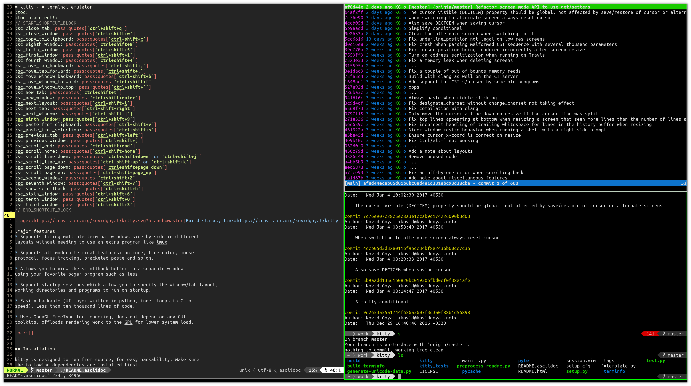
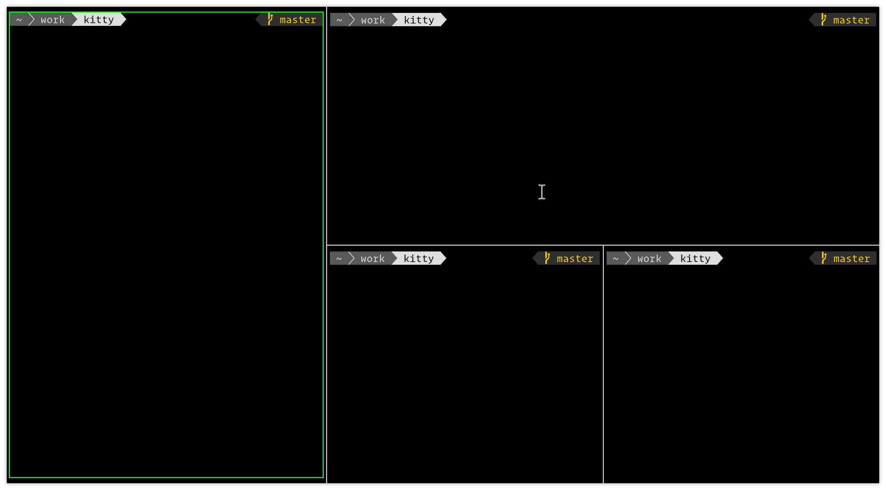
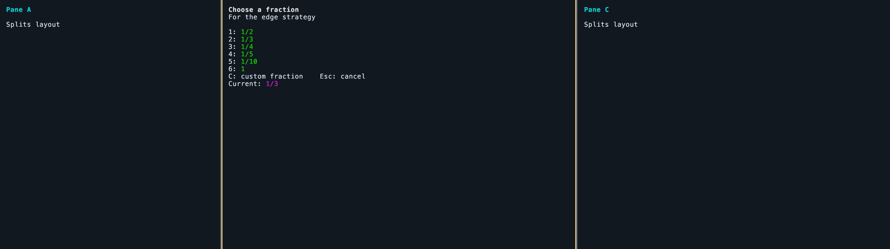

Arrange windows
-------------------

kitty has the ability to define its own windows that can be tiled next to each
other in arbitrary arrangements, based on *Layouts*, see below for examples:

    Screenshot, showing :program:`vim`, :program:`tig` and :program:`git`
    running in |kitty| with the *Tall* layout

    Screenshot, showing windows with arbitrary arrangement in the *Splits*
    layout

There are many different layouts available. They are all enabled by default, you
can switch layouts using :ac:`next_layout` (:sc:`next_layout` by default). To
control which layouts are available use :opt:`enabled_layouts`, the first listed
layout becomes the default. Individual layouts and how to use them are described
below.

The Stack Layout
------------------

This is the simplest layout. It displays a single window using all available
space, other windows are hidden behind it. This layout has no options::

    enabled_layouts stack

The Tall Layout
------------------

Displays one (or optionally more) full-height windows on the left half of the
screen. Remaining windows are tiled vertically on the right half of the screen.
There are options to control how the screen is split horizontally ``bias``
(an integer between ``10`` and ``90``) and options to control how many
full-height windows there are ``full_size`` (a positive integer). The
``mirrored`` option when set to ``true`` will cause the full-height windows to
be on the right side of the screen instead of the left. The syntax
for the options is::

    enabled_layouts tall:bias=50;full_size=1;mirrored=false

    ┌──────────────┬───────────────┐
    │              │               │
    │              │               │
    │              │               │
    │              ├───────────────┤
    │              │               │
    │              │               │
    │              │               │
    │              ├───────────────┤
    │              │               │
    │              │               │
    │              │               │
    └──────────────┴───────────────┘

In addition, you can map keys to increase or decrease the number of full-height
windows, or toggle the mirrored setting, for example::

   map ctrl+[ layout_action decrease_num_full_size_windows
   map ctrl+] layout_action increase_num_full_size_windows
   map ctrl+/ layout_action mirror toggle
   map ctrl+y layout_action mirror true
   map ctrl+n layout_action mirror false

You can also map a key to change the bias by providing a list of percentages
and it will rotate through the list as you press the key. If you only provide
one number it'll toggle between that percentage and 50, for example::

   map ctrl+. layout_action bias 50 62 70
   map ctrl+, layout_action bias 62

The Fat Layout
----------------

Displays one (or optionally more) full-width windows on the top half of the
screen. Remaining windows are tiled horizontally on the bottom half of the
screen. There are options to control how the screen is split vertically ``bias``
(an integer between ``10`` and ``90``) and options to control how many
full-width windows there are ``full_size`` (a positive integer). The
``mirrored`` option when set to ``true`` will cause the full-width windows to be
on the bottom of the screen instead of the top. The syntax for the options is::

    enabled_layouts fat:bias=50;full_size=1;mirrored=false

    ┌──────────────────────────────┐
    │                              │
    │                              │
    │                              │
    │                              │
    ├─────────┬──────────┬─────────┤
    │         │          │         │
    │         │          │         │
    │         │          │         │
    │         │          │         │
    │         │          │         │
    └─────────┴──────────┴─────────┘

This layout also supports the same layout actions as the *Tall* layout, shown above.

The Grid Layout
--------------------

Display windows in a balanced grid with all windows the same size except the
last column if there are not enough windows to fill the grid. This layout has no
options::

    enabled_layouts grid

    ┌─────────┬──────────┬─────────┐
    │         │          │         │
    │         │          │         │
    │         │          │         │
    │         │          │         │
    ├─────────┼──────────┼─────────┤
    │         │          │         │
    │         │          │         │
    │         │          │         │
    │         │          │         │
    └─────────┴──────────┴─────────┘

.. _splits_layout:

The Splits Layout
--------------------

This is the most flexible layout. You can create any arrangement of windows
by splitting existing windows repeatedly. To best use this layout you should
define a few extra key bindings in :file:`kitty.conf`::

    # Create a new window splitting the space used by the existing one so that
    # the two windows are placed one above the other
    map f5 launch --location=hsplit

    # Create a new window splitting the space used by the existing one so that
    # the two windows are placed side by side
    map f6 launch --location=vsplit

    # Create a new window splitting the space used by the existing one so that
    # the two windows are placed side by side if the existing window is wide or
    # one above the other if the existing window is tall.
    map f4 launch --location=split

    # Rotate the current split, changing its split axis from vertical to
    # horizontal or vice versa
    map f7 layout_action rotate

    # Move the active window in the indicated direction
    map shift+up move_window up
    map shift+left move_window left
    map shift+right move_window right
    map shift+down move_window down

    # Move the active window to the indicated screen edge
    map ctrl+shift+up layout_action move_to_screen_edge top
    map ctrl+shift+left layout_action move_to_screen_edge left
    map ctrl+shift+right layout_action move_to_screen_edge right
    map ctrl+shift+down layout_action move_to_screen_edge bottom

    # Switch focus to the neighboring window in the indicated direction
    map ctrl+left neighboring_window left
    map ctrl+right neighboring_window right
    map ctrl+up neighboring_window up
    map ctrl+down neighboring_window down

    # Set the bias of the split containing the currently focused window. The
    # currently focused window will take up the specified percent of its parent
    # window's size.
    map ctrl+. layout_action bias 80

    # Maximize the active window along the horizontal axis (fill full width),
    # keeping other windows visible in their vertical positions. Press again to
    # restore the original layout.
    map ctrl+shift+right layout_action maximize horizontal

    # Maximize the active window along the vertical axis (fill full height),
    # keeping other windows visible in their horizontal positions. Press again
    # to restore the original layout.
    map ctrl+shift+up layout_action maximize vertical

    # Equalize all splits so that windows share available space proportionally.
    map ctrl+shift+e layout_action equalize

Windows can be resized using :ref:`window_resizing`. You can swap the windows
in a split using the ``rotate`` action with an argument of ``180`` and rotate
and swap with an argument of ``270``. The ``maximize`` action expands the active
window to fill the maximum available space along a single axis while keeping
the rest of the layout intact. Use ``maximize horizontal`` to fill the full
width and ``maximize vertical`` to fill the full height. Calling it again
restores the original split sizes. The ``equalize`` action redistributes space
so that all windows along each split axis receive an equal share.

This layout takes three options. ``equalize_on_window_close`` automatically equalizes
split sizes whenever a window is closed, keeping remaining windows balanced
without needing an explicit keybinding::

    enabled_layouts splits:equalize_on_window_close=true

``proportional`` preserves the relative sizes of siblings along the same split
axis when adding, removing or repositioning windows. A new window receives the
same weight as the window being split, and the siblings are scaled to fit.
For example, splitting either of two equally sized side-by-side windows makes
three equally sized windows. Manually adjusted proportions are preserved when
windows are closed. Splits along the other axis keep their relative sizes::

    enabled_layouts splits:proportional=true

This option is disabled by default. An explicit :option:`launch --bias` overrides
proportional sizing for that new window. If ``equalize_on_window_close`` is also
enabled, closing a window equalizes the layout instead of preserving its weights.
The option is saved as part of a :doc:`session <sessions>`.

Dragging a divider resizes only the two adjacent regions along its axis. Other
dividers in the same row or column stay in place, including after repositioning
windows. Nested dividers follow the mouse in character-cell steps relative to
their own region, and stop when an adjacent region reaches its minimum size.

``split_axis`` controls whether new windows
are placed into vertical or horizontal splits when a :option:`--location
<launch --location>` is not specified. A value of ``horizontal`` (same as
``--location=vsplit``) means when a new split is created the two windows will
be placed side by side and a value of ``vertical`` (same as
``--location=hsplit``) means the two windows will be placed one on top of the
other. A value of ``auto`` means the axis of the split is chosen automatically
(same as ``--location=split``). By default::

    enabled_layouts splits:split_axis=horizontal

    ┌──────────────┬───────────────┐
    │              │               │
    │              │               │
    │              │               │
    │              ├───────┬───────┤
    │              │       │       │
    │              │       │       │
    │              │       │       │
    │              ├───────┴───────┤
    │              │               │
    │              │               │
    │              │               │
    └──────────────┴───────────────┘

.. versionadded:: 0.17.0
    The Splits layout

The Horizontal Layout
------------------------

All windows are shown side by side. This layout has no options::

    enabled_layouts horizontal

    ┌─────────┬──────────┬─────────┐
    │         │          │         │
    │         │          │         │
    │         │          │         │
    │         │          │         │
    │         │          │         │
    │         │          │         │
    │         │          │         │
    │         │          │         │
    │         │          │         │
    └─────────┴──────────┴─────────┘

The Vertical Layout
-----------------------

All windows are shown one below the other. This layout has no options::

    enabled_layouts vertical

    ┌──────────────────────────────┐
    │                              │
    │                              │
    │                              │
    ├──────────────────────────────┤
    │                              │
    │                              │
    │                              │
    ├──────────────────────────────┤
    │                              │
    │                              │
    │                              │
    └──────────────────────────────┘

.. _docks:

Docked windows
------------------

.. versionadded:: 0.50.0

A kitty window can be *docked* to an edge of another kitty window or to an
edge of the tab. Docked windows are placed outside the layout, which arranges
the other windows in the space that remains. They are useful for things like
status bars, file trees or a shell kept next to an editor. Create them with the
:doc:`launch <launch>` action, for example::

    # A one line status bar at the bottom of the tab that never gets keyboard focus
    map f1 launch --type=tab-dock --dock-edge=bottom --dock-size=1 --dock-skip-focus my-status-bar
    # A file tree using a quarter of the width of the active window, at its left
    map f2 launch --type=window-dock --dock-edge=left --dock-size=25% yazi

The size of a dock is a number of rows (for docks at the top or bottom edge) or
columns (for docks at the left or right edge), or with a :code:`%` suffix, a
percentage of the window or tab being docked to. When there are several docks
at an edge, later docks are placed inside earlier ones. When there is not
enough space for all the docks, the docks created last are made smaller first.

A :code:`window-dock` belongs to the window it is docked to. It is shown
whenever that window is shown, moves with it when it is moved to another tab
and is closed when it is closed. A :code:`tab-dock` is closed when the last
window in the tab that is not docked is closed.

Docks can be focused like other windows, by clicking on them, with
:ac:`neighboring_window` or :ac:`nth_window` with a negative number, unless they
were created with :option:`launch --dock-skip-focus`. Docks are not part of the
layout, so they are not affected by actions such as :ac:`move_window`,
:ac:`next_window` or :ac:`layout_action`. Docks are saved in :doc:`sessions
<sessions>`.

.. _window_resizing:

Resizing windows
------------------

You can resize windows inside layouts. The easiest method is to simply drag the
window borders using a mouse, controlled by the option :opt:`window_drag_tolerance`.
Note that technically this resizes layout slots not actual windows, so it
does not work exactly like resizing OS Windows on your desktop. Instead, the
layout is changed and potentially multiple windows get resized when dragging a
single border.

For keyboard friendly resizing, press :sc:`start_resizing_window` (also
:kbd:`⌘+r` on macOS) to enter resizing mode and follow the on-screen
instructions. In a given window layout only some operations may be possible for
a particular window. For example, in the *Tall* layout you can make the first
window wider/narrower, but not taller/shorter. Note that what you are resizing
is actually not a window, but a row/column in the layout, all windows in that
row/column will be resized.

By default, hold :kbd:`Alt` with :kbd:`W`, :kbd:`N`, :kbd:`T`, or :kbd:`S` to take a fraction
of the remaining resize steps in that direction. The default is one third,
rounded up: five remaining steps become two, and one remaining step becomes
one. Resizing stops at the layout's size limit. Ordinary letters (including
uppercase letters) keep their normal step size unless Shift is selected as
the fractional modifier, and :kbd:`Ctrl` doubles it.
To choose a different fraction, pass :code:`--fraction`
to the resize kitten, for example::

   map kitty_mod+r kitten resize_window --fraction=1/4
   # macOS
   map cmd+r kitten resize_window --fraction=1/3

Inside the resize page, :kbd:`1` selects the Window strategy and :kbd:`2`
selects the Edge strategy. :kbd:`M` switches the fractional modifier between
Alt and Shift, and :kbd:`F` opens fraction presets or a custom ratio/decimal.
Each strategy's modifier and fraction are saved independently, together with
the selected strategy. Explicit :code:`--strategy` and :code:`--fraction`
options override saved values for that invocation.

    F opens fraction settings for the active strategy; C accepts a custom
    ratio or decimal. The other strategy's saved settings are kept separately.

To move a specific divider in the *Splits* layout, select the edge strategy::

   map kitty_mod+r kitten resize_window --strategy=edge --fraction=1/3
   # macOS, with a different fractional step
   map cmd+r kitten resize_window --strategy=edge --fraction=1/4

First press :kbd:`H`, :kbd:`J`, :kbd:`K`, or :kbd:`L` to select the left,
bottom, top, or right edge of the current pane. Arrow keys also work.
This first key only selects the edge. Outside edges have no internal divider
and cannot be selected. If there is exactly one internal edge, it is selected
automatically on entering this strategy. Then use :kbd:`H`/:kbd:`L` for a left or right edge,
or :kbd:`J`/:kbd:`K` for a top or bottom edge, to move the selected divider
in the direction of the key. Neighboring parallel dividers stay in place;
perpendicular subtrees resize as units.

The chosen Alt/Shift modifier takes the configured fraction of the remaining
steps; :kbd:`Ctrl` doubles the normal step. The other modifier retains the
normal step size. :kbd:`Esc` returns to edge selection; press it again to exit.
:kbd:`Enter` or :kbd:`Q` exits immediately.

In Splits, either strategy uses :kbd:`R` to restore the divider proportions saved when
resize mode opened, rather than equalizing the layout. If the split structure
has changed since then, restoration is refused. The initial default
:code:`--strategy=window` retains the usual width/height controls. Other layouts,
and Splits when resize mode was opened in a different layout, keep Window's
default-size reset behavior. Starting the resize kitten again while its page is
open replaces the page, applying the new options and keeping the saved sizes.

You can also define shortcuts in :file:`kitty.conf` to make the active window
wider, narrower, taller, or shorter by mapping to the :ac:`resize_window`
action, for example::

   map ctrl+left resize_window narrower
   map ctrl+right resize_window wider
   map ctrl+up resize_window taller
   map ctrl+down resize_window shorter 3
   # reset all windows in the tab to default sizes
   map ctrl+home resize_window reset

The :ac:`resize_window` action has a second optional argument to control
the resizing increment (a positive integer that defaults to 1).

Some layouts take options to control their behavior. For example, the *Fat*
and *Tall* layouts accept the ``bias`` and ``full_size`` options to control
how the available space is split up. To specify the option, in :opt:`kitty.conf
<enabled_layouts>` use::

    enabled_layouts tall:bias=70;full_size=2

This will have ``2`` instead of a single tall window, that occupy ``70%``
instead of ``50%`` of available width. ``bias`` can be any number between ``10``
and ``90``.

Writing a new layout only requires about two hundred lines of code, so if there
is some layout you want, take a look at one of the existing layouts in the
:repo_folder:`layout <kitty/layout>` package and submit a pull request!
