# Cursor-trail screenshot matrix

These screenshots were generated with `kitty_tests/generate_cursor_trail_matrix.zsh`
using the release build from this checkout. Each case uses the same large cursor
jump; `active` means the target window is focused and `inactive` means the helper
window is focused. The motion-blur mode is ignored when motion blur is disabled,
but both values are included to make that behavior explicit.

## Disconnected mode

| Focus | Cursor type | none | +AA | +MB | +AA +MB |
|---|---|---|---|---|---|
| active | `block` | 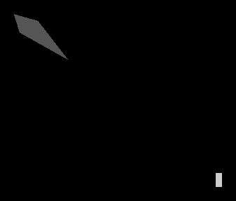 |  |  |  |
| active | `beam` | 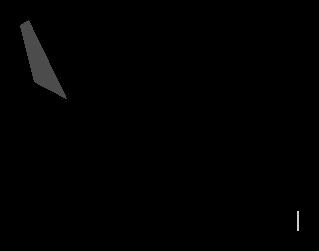 |  | 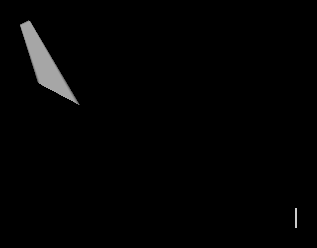 | 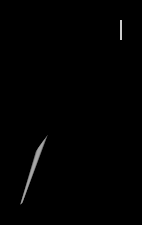 |
| active | `underline` | 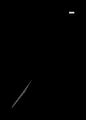 | 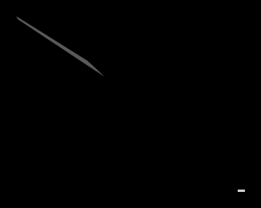 |  | 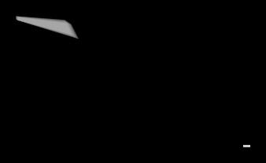 |
| inactive | `block` |  |  | 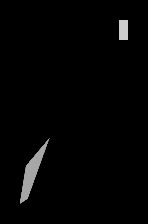 | 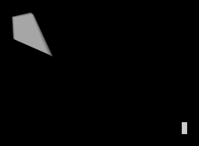 |
| inactive | `beam` | 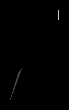 |  | 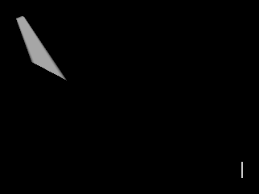 | 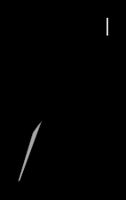 |
| inactive | `underline` |  | 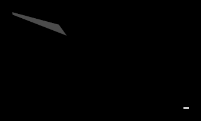 | 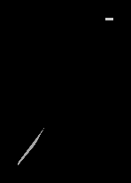 | 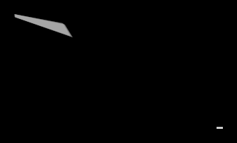 |

## Connected mode

| Focus | Cursor type | none | +AA | +MB | +AA +MB |
|---|---|---|---|---|---|
| active | `block` |  | 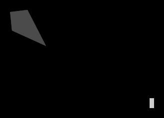 |  | 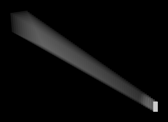 |
| active | `beam` | 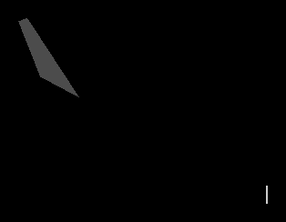 | 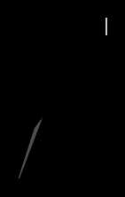 | 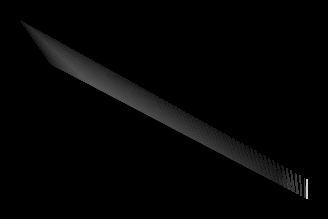 | 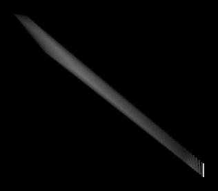 |
| active | `underline` |  | 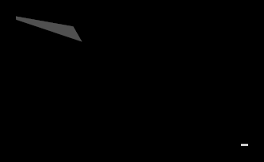 | 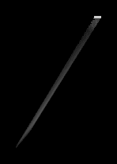 | 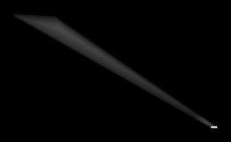 |
| inactive | `block` |  |  | 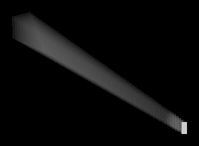 | 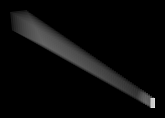 |
| inactive | `beam` |  |  | 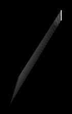 | 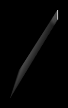 |
| inactive | `underline` | 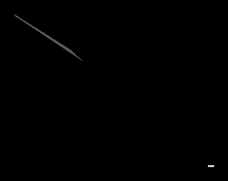 |  |  | 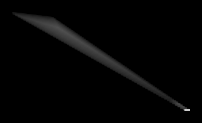 |
